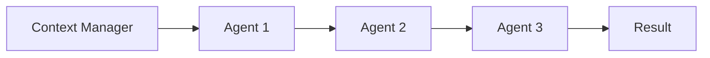
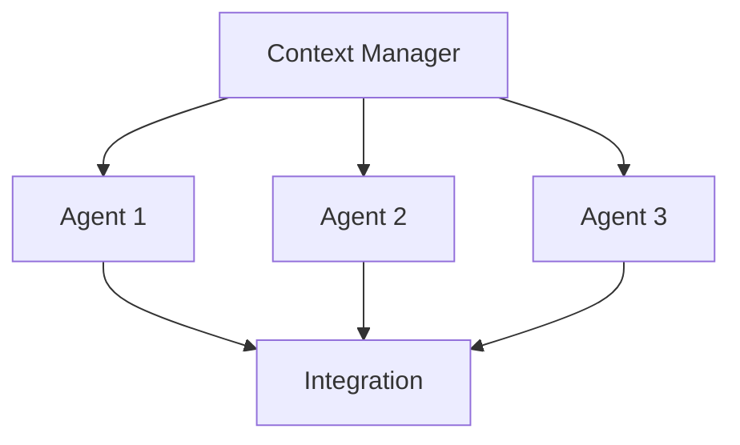
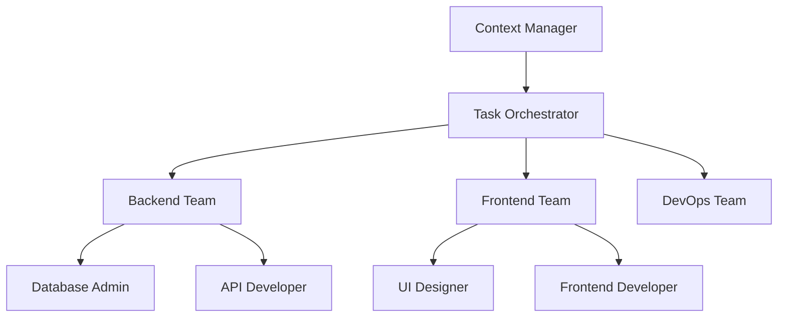

# Agent System Documentation

## Overview

This document describes the sophisticated multi-agent AI system designed for the AI-Powered
Strategic Planning Platform. The system orchestrates 83 specialized agents to deliver
enterprise-grade AI-powered applications through coordinated workflows managed by a central Context
Manager.

## Architecture Principles

### 1. Multi-Agent Coordination

The system employs a **hub-and-spoke architecture** with the Context Manager as the central
orchestrator coordinating specialized agents based on domain expertise and task requirements.

### 2. Context-Driven Execution

All agents operate within a shared context framework that maintains project state, architectural
decisions, and integration points across development sessions.

### 3. Quality-First Approach

Each agent handoff includes validation gates ensuring deliverables meet specified quality thresholds
before proceeding to the next phase.

## Agent Categories & Responsibilities

### 🎯 Core Orchestration

- **[context-manager](./context-manager.md)**: Central coordination hub maintaining project state
  across multi-agent workflows
- **[task-orchestrator](./task-orchestrator.md)**: Task Master workflow coordination with parallel
  execution optimization
- **[task-executor](./task-executor.md)**: Individual task execution with error handling and
  progress reporting
- **[task-checker](./task-checker.md)**: Quality validation and completion verification

### 💻 Development Specialists

- **AI/ML Engineering**: GraphRAG implementation, LLM integration, hallucination prevention
- **Backend Development**: Scalable APIs, microservices, database integration
- **Frontend Development**: Modern UI with Nuxt.js 4, Vue 3, TypeScript
- **Full-Stack Integration**: End-to-end feature development across entire stack

### 🏗️ Infrastructure & Operations

- **Cloud Architecture**: Multi-cloud infrastructure design and optimization
- **DevOps Engineering**: CI/CD pipelines, containerization, deployment automation
- **Database Management**: Neo4j optimization, PostgreSQL administration, query tuning
- **Security Operations**: Vulnerability assessment, compliance verification, incident response

### 🔧 Language & Framework Specialists

Specialized agents for **13 programming languages** including Python, TypeScript, Go, Rust, Java,
and more, each optimized for language-specific patterns and best practices.

### 📊 Business & Analytics

- **Business Analysis**: Metrics tracking, KPI development, growth projections
- **Content Strategy**: SEO optimization, marketing automation, customer support
- **Risk Management**: Portfolio analysis, compliance monitoring, strategic planning

## Coordination Patterns

### Pattern 1: Sequential Workflows

**Use Case**: Feature development requiring specific order of operations

### Pattern 2: Parallel Execution

**Use Case**: Independent tasks that can be executed simultaneously

### Pattern 3: Hierarchical Coordination

**Use Case**: Complex multi-domain projects requiring specialized team coordination

## Agent Selection Algorithm

### 1. Context Analysis

The Context Manager analyzes:

- **Complexity Score**: Token count and architectural scope
- **Domain Requirements**: Technical specializations needed
- **Integration Points**: Cross-system dependencies
- **Quality Standards**: Performance and security requirements

### 2. Agent Matching

Selection criteria include:

- **Capability Alignment**: Agent expertise matches task requirements
- **Tool Availability**: Required MCP tools and integrations
- **Model Efficiency**: Optimal Claude model for task complexity
- **Coordination Patterns**: Integration with other agents

### 3. Dynamic Orchestration

Real-time adjustments based on:

- **Agent Availability**: Load balancing across agents
- **Quality Feedback**: Performance metrics and success rates
- **Context Updates**: Changing project requirements
- **Error Recovery**: Automatic failover and retry logic

## Quality Assurance Framework

### Validation Gates

Each agent handoff includes:

- **Deliverable Completeness**: All requirements addressed
- **Technical Accuracy**: Implementation follows best practices
- **Integration Readiness**: Compatible with downstream agents
- **Performance Compliance**: Meets specified benchmarks

### Success Metrics

- **Task Completion Rate**: >90% successful completion
- **Quality Score**: >8.5/10 average output quality
- **Handoff Efficiency**: <5 minutes between agent transitions
- **Context Retention**: >95% relevant information preservation

### Error Handling

- **Automatic Recovery**: Intelligent retry with context adjustment
- **Escalation Paths**: Human intervention for complex blockers
- **State Preservation**: Transaction-like rollback capabilities
- **Learning Integration**: Pattern recognition for future improvement

## Advanced Features

### 1. Context Memory Management

- **Active Context**: Current sprint activities and immediate dependencies
- **Project Context**: Architectural standards and established patterns
- **Archived Context**: Historical decisions and resolved issues
- **Smart Compression**: Automated context optimization for token efficiency

### 2. Multi-Model Optimization

- **Haiku (25 agents)**: Fast, cost-effective for routine tasks
- **Sonnet (44 agents)**: Balanced performance for core development
- **Opus (14 agents)**: Maximum capability for critical systems

### 3. Integration Ecosystem

- **Task Master**: Structured task management and progress tracking
- **MCP Tools**: Comprehensive tooling ecosystem across agents
- **Quality Gates**: Automated validation between workflow phases
- **Performance Monitoring**: Real-time metrics and optimization

## Usage Guidelines

### When to Use Multi-Agent Coordination

✅ **Complex Features**: Requiring 3+ specialized domains  
✅ **Cross-Functional Work**: Spanning multiple system layers  
✅ **Large-Scale Changes**: Architectural modifications or refactoring  
✅ **Enterprise Projects**: >10,000 tokens of context or complexity

### When to Use Single Agents

✅ **Focused Tasks**: Domain-specific, well-defined requirements  
✅ **Quick Fixes**: Small enhancements or bug fixes  
✅ **Exploration**: Prototyping or research activities  
✅ **Component Development**: Individual feature implementation

### Best Practices

1. **Start with Context Manager** for workflows requiring coordination
2. **Define Clear Success Criteria** for each agent's deliverables
3. **Maintain Quality Gates** between agent transitions
4. **Document Architectural Decisions** for future reference
5. **Use Task Master Integration** for structured development workflows

## Performance Characteristics

### Scalability

- **Concurrent Operations**: Support for parallel agent execution
- **Context Scaling**: Efficient memory management for large projects
- **Dynamic Loading**: On-demand agent activation based on requirements
- **Resource Optimization**: Intelligent model selection for cost efficiency

### Reliability

- **Fault Tolerance**: Graceful handling of agent failures
- **State Consistency**: Transaction-like workflow management
- **Recovery Mechanisms**: Automatic retry and escalation procedures
- **Quality Assurance**: Comprehensive validation at each workflow stage

### Extensibility

- **Plugin Architecture**: Easy addition of new specialized agents
- **Configuration Flexibility**: Customizable coordination patterns
- **Integration APIs**: Seamless connection with external systems
- **Monitoring Hooks**: Comprehensive observability and metrics collection

## Integration with Strategic Planning Platform

### GraphRAG Coordination

- **AI Engineer**: Implements Microsoft GraphRAG with Neo4j backend
- **Database Admin**: Optimizes graph queries and vector operations
- **Search Specialist**: Enhances retrieval relevance and performance
- **Backend Developer**: Integrates validation APIs with FastAPI services

### Frontend Development

- **UI Designer**: Creates ink/indigo design system with accessibility standards
- **Frontend Developer**: Implements Nuxt.js 4 components with TypeScript
- **Vue Expert**: Optimizes Composition API patterns and state management
- **Test Automator**: Ensures comprehensive UI and E2E test coverage

### Production Deployment

- **Cloud Architect**: Designs scalable infrastructure supporting 100+ concurrent users
- **Deployment Engineer**: Implements CI/CD with Docker and Kubernetes
- **Performance Engineer**: Achieves <200ms API response times
- **Security Auditor**: Ensures <2% hallucination rate through validation layers

## Monitoring & Observability

### Agent Performance Metrics

- **Response Time**: Average <30 seconds for standard tasks
- **Success Rate**: >90% task completion without errors
- **Quality Score**: Consistent >8.5/10 output quality
- **Context Utilization**: >95% relevant information usage

### System Health Indicators

- **Workflow Efficiency**: <5 minutes average agent handoff time
- **Integration Success**: >90% successful multi-agent coordination
- **Resource Utilization**: Optimal model selection and cost management
- **Error Recovery**: <2% unrecoverable workflow failures

### Business Impact Metrics

- **Development Velocity**: 80% reduction in planning cycles
- **Quality Improvement**: 90% stakeholder satisfaction
- **Cost Optimization**: Efficient resource allocation across agent types
- **Innovation Acceleration**: Faster delivery of complex features

---

_This agent system represents a sophisticated approach to AI-powered software development, combining
specialized domain expertise with intelligent coordination to deliver enterprise-grade solutions
efficiently and reliably._
