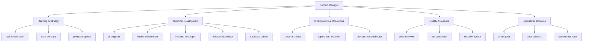

Here is the comprehensive list of agents which I already have, in addition to these what other
agents do i need to # AI Agents Directory

## Overview

This directory contains specialized AI agent definitions for the AI-Powered Strategic Planning
Platform. Each agent represents a domain expert with specific tools, capabilities, and coordination
patterns designed to work within the multi-agent architecture orchestrated by the Context Manager.

The collection contains 95 specialized agents\*\* that extend Claude Code's capabilities for
building enterprise-grade AI-powered applications. Each agent is an expert in a specific domain,
automatically invoked based on context or explicitly called when needed. All agents are configured
with specific Claude models based on task complexity for optimal performance and cost-effectiveness.

## Agent Architecture



## Agent Categories

| **Agent**                 | **Description**                                                                                 | **Primary Tools**                                                                                                            |
| ------------------------- | ----------------------------------------------------------------------------------------------- | ---------------------------------------------------------------------------------------------------------------------------- |
| hallucination-trace-agent | Advanced hallucination detection and validation agent for GraphRAG-powered content verification | Read, Trace, GraphRAG, Annotate                                                                                              |
| provenance-auditor        | Complete traceability and source verification agent for all generated content                   | Graph Traversal ,Engine, <br> Source Link Validator, Claim Extractor, Evidence Mapper, Audit Report Generator                |
| wbs-structuring-agent     | Intelligent work breakdown structure generator with dependency analysis and effort estimation   | Task Decomposer, Dependency Analyzer, Critical Path Calculator, Effort Estimator, Resource Optimizer, GitHub Issue Generator |
| feedback-loop-tracker     | Continuous improvement agent that tracks feedback patterns and optimizes agent performance      | Feedback Analyzer, Pattern Detector, Prompt Optimizer, Revision Tracker, Learning Pipeline                                   |
| cost-optimization-agent   | Intelligent cost management agent for multi-model LLM usage optimization                        | Token Counter, Cost Calculator, Model Selector, Cache Manager, Usage Analyzer, Budget Enforcer                               |
| compliance-officer-agent  | Enterprise compliance validation and regulatory enforcement agent                               | Compliance Checker, Policy Validator, Audit Logger, Regulation Scanner, Risk Assessor, Certification Manager                 |
| change-management-agent   | Intelligent change tracking and impact analysis agent for requirement evolution                 | Diff Engine, Impact Analyzer, Notification Manager, Version Controller, Dependency Tracker, Rollback Manager                 |

| **Agent**                     | **Purpose**                                                                          | **Notes**                       |
| ----------------------------- | ------------------------------------------------------------------------------------ | ------------------------------- |
| AI Agent Performance Profiler | Tracks response time, quality score, failure rate for each agent                     | For internal benchmarking       |
| User Behavior Analyst         | Analyzes platform usage to tune UX flows and agent prioritization                    | Based on telemetry and metadata |
| Human-in-the-Loop Handler     | Flags uncertain results and coordinates with humans for manual review                | Key for RLHF + compliance loop  |
| API Schema Auto-Migrator      |   Automatically updates OpenAPI and agent API specs when model or data layer changes | For faster API-first evolution  |
| Training Data Steward         |   Validates and updates prompt embeddings and context documents in vector DB         |   For ongoing semantic accuracy |

### 🎯 Planning & Strategy Agents

| Agent                                       | Description                                                                         | Primary Tools     |
| ------------------------------------------- | ----------------------------------------------------------------------------------- | ----------------- |
| [context-manager](./context-manager.md)     | **Core Orchestrator** - Manages multi-agent workflows and maintains project context | All MCP tools     |
| [task-orchestrator](./task-orchestrator.md) | Coordinates Task Master workflows with parallel execution optimization              | Task Master MCP   |
| [task-executor](./task-executor.md)         | Executes individual tasks with proper error handling and reporting                  | Task Master MCP   |
| [task-checker](./task-checker.md)           | Validates task completion and quality assurance                                     | Task Master MCP   |
| [prompt-engineer](./prompt-engineer.md)     | Optimizes prompts for GraphRAG and LLM interactions                                 | OpenAI, Anthropic |

### 💻 Core Development Agents

| Agent                                           | Description                                                        | Primary Tools               |
| ----------------------------------------------- | ------------------------------------------------------------------ | --------------------------- |
| [ai-engineer](./ai-engineer.md)                 | GraphRAG implementation, LLM integration, hallucination prevention | Python, TensorFlow, PyTorch |
| [backend-developer](./backend-developer.md)     | Scalable API development and microservices architecture            | Node.js, Python, PostgreSQL |
| [backend-architect](./backend-architect.md)     | API design, microservice boundaries, and system architecture       | All development tools       |
| [frontend-developer](./frontend-developer.md)   | Modern UI development with React, Vue, Angular                     | Vite, TypeScript, Testing   |
| [fullstack-developer](./fullstack-developer.md) | End-to-end feature development across entire stack                 | Full development stack      |
| [typescript-pro](./typescript-pro.md)           | Advanced TypeScript development with type safety                   | TypeScript, ESLint, Jest    |

### 🏗️ Infrastructure & DevOps Agents

| Agent                                                 | Description                                                 | Primary Tools                      |
| ----------------------------------------------------- | ----------------------------------------------------------- | ---------------------------------- |
| [cloud-architect](./cloud-architect.md)               | Cloud infrastructure design and scalability planning        | AWS, Azure, GCP, Terraform         |
| [hybrid-cloud-architect](./hybrid-cloud-architect.md) | Hybrid cloud across AWS/Azure/GCP and OpenStack on-premises | Multi-cloud, OpenStack             |
| [deployment-engineer](./deployment-engineer.md)       | CI/CD pipelines and production deployments                  | Docker, Kubernetes, GitHub Actions |
| [devops-troubleshooter](./devops-troubleshooter.md)   | Production debugging and system reliability                 | Monitoring, Logging, Alerting      |
| [kubernetes-architect](./kubernetes-architect.md)     | Container orchestration and cloud-native patterns           | Kubernetes, Helm, Service Mesh     |
| [terraform-specialist](./terraform-specialist.md)     | Infrastructure as Code with advanced Terraform              | Terraform, Terragrunt, Cloud APIs  |
| [incident-responder](./incident-responder.md)         | Critical incident management and resolution                 | Monitoring, Communication          |
| [network-engineer](./network-engineer.md)             | Network connectivity, load balancers, SSL/TLS               | Network tools, Debugging           |

### 🗄️ Data & Database Agents

| Agent                                         | Description                                  | Primary Tools                     |
| --------------------------------------------- | -------------------------------------------- | --------------------------------- |
| [database-admin](./database-admin.md)         | Database operations and maintenance          | PostgreSQL, Redis, Neo4j          |
| [database-optimizer](./database-optimizer.md) | Performance tuning and indexing strategies   | SQL profiling, Query optimization |
| [postgres-pro](./postgres-pro.md)             | PostgreSQL administration and optimization   | PostgreSQL, pgAdmin, Extensions   |
| [data-engineer](./data-engineer.md)           | ETL pipelines and data architecture          | Apache Spark, Airflow, Kafka      |
| [data-scientist](./data-scientist.md)         | Data analysis and machine learning workflows | Python, Jupyter, BigQuery         |

### 🎨 Design & User Experience Agents

| Agent                                 | Description                               | Primary Tools                  |
| ------------------------------------- | ----------------------------------------- | ------------------------------ |
| [ui-designer](./ui-designer.md)       | Visual design and user interface creation | Figma, Design Systems          |
| [ui-ux-designer](./ui-ux-designer.md) | Comprehensive user experience design      | Research, Prototyping, Testing |
| [vue-expert](./vue-expert.md)         | Vue.js 3 development with Composition API | Vue 3, Nuxt 3, Pinia           |

### 🔒 Security & Quality Agents

| Agent                                             | Description                                   | Primary Tools                     |
| ------------------------------------------------- | --------------------------------------------- | --------------------------------- |
| [security-auditor](./security-auditor.md)         | Security reviews and vulnerability assessment | OWASP tools, Penetration testing  |
| [code-reviewer](./code-reviewer.md)               | Code quality assessment and best practices    | Static analysis, Code standards   |
| [test-automator](./test-automator.md)             | Comprehensive test strategy and automation    | Jest, Playwright, Cypress         |
| [performance-engineer](./performance-engineer.md) | Performance optimization and monitoring       | Profiling tools, Load testing     |
| [debugger](./debugger.md)                         | Bug investigation and error resolution        | Debug tools, Log analysis         |
| [error-detective](./error-detective.md)           | Log analysis and error pattern recognition    | Log aggregation, Pattern matching |

### 📝 Content & Documentation Agents

| Agent                                       | Description                                     | Primary Tools                     |
| ------------------------------------------- | ----------------------------------------------- | --------------------------------- |
| [docs-architect](./docs-architect.md)       | Technical documentation and architecture guides | Markdown, Diagrams, API docs      |
| [tutorial-engineer](./tutorial-engineer.md) | Educational content and onboarding materials    | Documentation tools               |
| [reference-builder](./reference-builder.md) | API references and technical specifications     | OpenAPI, Documentation generation |
| [api-documenter](./api-documenter.md)       | API documentation and SDK generation            | Swagger, OpenAPI, SDKs            |
| [mermaid-expert](./mermaid-expert.md)       | Diagrams and visual documentation               | Mermaid, Flowcharts, ERDs         |

### 📊 Business & Analytics Agents

| Agent                                     | Description                             | Primary Tools                      |
| ----------------------------------------- | --------------------------------------- | ---------------------------------- |
| [business-analyst](./business-analyst.md) | Metrics analysis and KPI tracking       | Analytics platforms, Reporting     |
| [content-marketer](./content-marketer.md) | Marketing content and growth strategies | Content tools, SEO                 |
| [customer-support](./customer-support.md) | Support documentation and help systems  | Support platforms, Knowledge bases |
| [sales-automator](./sales-automator.md)   | Sales process automation and CRM        | Sales tools, Automation            |
| [hr-pro](./hr-pro.md)                     | HR processes and policy development     | HR systems, Compliance             |
| [legal-advisor](./legal-advisor.md)       | Legal documentation and compliance      | Legal templates, Compliance        |

### 🔧 Language Specialists

| Agent                                 | Description                                  | Primary Tools                          |
| ------------------------------------- | -------------------------------------------- | -------------------------------------- |
| [python-pro](./python-pro.md)         | Advanced Python development and optimization | Python, FastAPI, Django                |
| [javascript-pro](./javascript-pro.md) | Modern JavaScript and Node.js development    | ES6+, Node.js, Performance             |
| [golang-pro](./golang-pro.md)         | Go development with concurrency patterns     | Go, Goroutines, Microservices          |
| [rust-pro](./rust-pro.md)             | Systems programming with Rust                | Rust, Cargo, Performance               |
| [java-pro](./java-pro.md)             | Enterprise Java development                  | Spring Boot, JVM, Concurrency          |
| [csharp-pro](./csharp-pro.md)         | .NET development with C#                     | .NET Core, Entity Framework            |
| [php-pro](./php-pro.md)               | Modern PHP development and frameworks        | PHP 8+, Laravel, Symfony               |
| [ruby-pro](./ruby-pro.md)             | Ruby on Rails development                    | Rails, Ruby gems, Testing              |
| [c-pro](./c-pro.md)                   | Systems programming with C                   | C, Memory management, Embedded         |
| [cpp-pro](./cpp-pro.md)               | Modern C++ development                       | C++17/20, STL, Templates               |
| [elixir-pro](./elixir-pro.md)         | Functional programming with Elixir           | Elixir, OTP, Phoenix                   |
| [scala-pro](./scala-pro.md)           | Enterprise Scala development                 | Scala, Akka, Spark                     |
| [sql-pro](./sql-pro.md)               | Advanced SQL and database design             | SQL, Query optimization, Schema design |

### 🤖 AI & Machine Learning Agents

| Agent                                 | Description                                       | Primary Tools                 |
| ------------------------------------- | ------------------------------------------------- | ----------------------------- |
| [llm-architect](./llm-architect.md)   | Large language model architecture and deployment  | LLM frameworks, Model serving |
| [ml-engineer](./ml-engineer.md)       | Machine learning model development and deployment | TensorFlow, PyTorch, MLOps    |
| [mlops-engineer](./mlops-engineer.md) | ML pipeline automation and model lifecycle        | MLflow, Kubeflow, Monitoring  |

### 🎮 Specialized Domain Agents

| Agent                                             | Description                                 | Primary Tools                 |
| ------------------------------------------------- | ------------------------------------------- | ----------------------------- |
| [unity-developer](./unity-developer.md)           | Game development with Unity engine          | Unity, C#, Game mechanics     |
| [flutter-expert](./flutter-expert.md)             | Cross-platform mobile development           | Flutter, Dart, Mobile APIs    |
| [ios-developer](./ios-developer.md)               | Native iOS development                      | Swift, SwiftUI, Xcode         |
| [mobile-developer](./mobile-developer.md)         | React Native and cross-platform development | React Native, Mobile patterns |
| [wordpress-master](./wordpress-master.md)         | WordPress development and customization     | WordPress, PHP, Plugins       |
| [minecraft-bukkit-pro](./minecraft-bukkit-pro.md) | Minecraft server plugin development         | Bukkit, Spigot, Paper APIs    |
| [payment-integration](./payment-integration.md)   | Payment processing and e-commerce           | Stripe, PayPal, Payment APIs  |

### 📊 SEO & Marketing Specialists

| Agent                                                             | Description                             | Primary Tools                     |
| ----------------------------------------------------------------- | --------------------------------------- | --------------------------------- |
| [seo-content-writer](./seo-content-writer.md)                     | SEO-optimized content creation          | Content optimization              |
| [seo-content-auditor](./seo-content-auditor.md)                   | Content quality and E-E-A-T analysis    | SEO analysis tools                |
| [seo-keyword-strategist](./seo-keyword-strategist.md)             | Keyword research and optimization       | Keyword tools, Analytics          |
| [seo-meta-optimizer](./seo-meta-optimizer.md)                     | Meta tags and SERP optimization         | SEO tools, Testing                |
| [seo-structure-architect](./seo-structure-architect.md)           | Content structure and schema markup     | SEO tools, Structured data        |
| [seo-snippet-hunter](./seo-snippet-hunter.md)                     | Featured snippet optimization           | SERP analysis, Content formatting |
| [seo-content-planner](./seo-content-planner.md)                   | Content strategy and planning           | Content calendars, Topic research |
| [seo-content-refresher](./seo-content-refresher.md)               | Content updates and freshness           | Content analysis, Updating        |
| [seo-authority-builder](./seo-authority-builder.md)               | Authority signals and E-E-A-T           | Trust signals, Authority building |
| [seo-cannibalization-detector](./seo-cannibalization-detector.md) | Keyword overlap and conflict resolution | SEO analysis, Content strategy    |

### 💼 Specialized Business Functions

| Agent                                                 | Description                                 | Primary Tools                 |
| ----------------------------------------------------- | ------------------------------------------- | ----------------------------- |
| [quant-analyst](./quant-analyst.md)                   | Financial modeling and trading algorithms   | Financial tools, Analytics    |
| [risk-manager](./risk-manager.md)                     | Risk assessment and mitigation strategies   | Risk analysis, Monitoring     |
| [legacy-modernizer](./legacy-modernizer.md)           | Legacy system modernization                 | Refactoring, Migration tools  |
| [refactoring-specialist](./refactoring-specialist.md) | Code refactoring and technical debt         | AST tools, Code analysis      |
| [search-specialist](./search-specialist.md)           | Advanced research and information gathering | Search techniques, Analysis   |
| [dx-optimizer](./dx-optimizer.md)                     | Developer experience optimization           | Tooling, Workflow improvement |

## Agent Coordination Patterns

### 1. Context-Driven Activation

All agents follow a standardized activation pattern:

1. **Context Query**: Request project context from Context Manager
2. **Requirement Analysis**: Understand specific task requirements
3. **Tool Preparation**: Initialize required MCP tools and integrations
4. **Execution**: Perform specialized work with progress reporting
5. **Handoff**: Prepare deliverables and context for next agent

### 2. Multi-Agent Workflows

#### Frontend Feature Development

```
Context Manager → ui-designer → frontend-developer → test-automator → deployment-engineer
```

#### GraphRAG Implementation

```
Context Manager → ai-engineer → database-admin → search-specialist → backend-developer
```

#### Full-Stack Application

```
Context Manager → task-orchestrator → [backend-developer, frontend-developer, database-admin] → test-automator
```

### 3. Integration Points

- **Context Manager**: Central coordination hub for all agents
- **Task Master Integration**: Specialized agents for task-driven development
- **MCP Tools**: Shared tooling ecosystem across agents
- **Quality Gates**: Automated validation between agent handoffs

## Usage Guidelines

### When to Use Multi-Agent Coordination

- ✅ Complex features requiring 3+ specialized domains
- ✅ Cross-functional work spanning frontend, backend, and data layers
- ✅ Large-scale refactoring or architectural changes
- ✅ Projects exceeding 10,000 tokens of context

### When to Use Single Agents

- ✅ Focused, domain-specific tasks
- ✅ Quick fixes or small enhancements
- ✅ Exploratory work or prototyping
- ✅ Individual component development

### Best Practices

1. **Always start with Context Manager** for complex workflows
2. **Provide clear success criteria** for each agent
3. **Use Task Master integration** for structured development
4. **Maintain quality gates** between agent transitions
5. **Document architectural decisions** for future reference

## Configuration

Each agent is defined with:

- **Name**: Unique identifier for agent selection
- **Description**: Capability summary and use cases
- **Tools**: MCP tools and integrations available
- **Model**: Preferred AI model (e.g., opus, sonnet)
- **Color**: UI categorization (optional)

Example agent header:

```yaml
---
name: backend-developer
description: Senior backend engineer specializing in scalable API development
tools: Read, Write, MultiEdit, Bash, Docker, database, redis, postgresql
model: sonnet
---
```

## Model Distribution

All 83 agents are configured with specific Claude models based on task complexity:

### 🚀 Haiku (Fast & Cost-Effective) - 25 agents

Business analysis, content creation, SEO optimization, and documentation tasks.

### ⚡ Sonnet (Balanced Performance) - 44 agents

Core development, language specialization, infrastructure operations, and quality assurance.

### 🧠 Opus (Maximum Capability) - 14 agents

Critical systems, AI/ML engineering, security auditing, and complex orchestration.

## Performance Metrics

### Agent Effectiveness

- **Task Completion Rate**: >90% successful task completion
- **Quality Score**: >8.5/10 average output quality
- **Response Time**: <30 seconds for standard tasks
- **Context Retention**: >95% relevant context utilization

### Multi-Agent Coordination

- **Handoff Efficiency**: <5 minutes between agent transitions
- **Context Accuracy**: >95% relevant information transfer
- **Integration Success**: >90% successful multi-agent workflows
- **Timeline Adherence**: Projects complete within 110% of estimates

## Contributing

To add new agents:

1. Create agent file following the established YAML frontmatter format
2. Include comprehensive capability descriptions
3. Specify required MCP tools and integrations
4. Add coordination patterns with existing agents
5. Update this README with the new agent classification

For agent modifications:

1. Maintain backward compatibility with Context Manager
2. Update coordination patterns if capabilities change
3. Test integration with dependent agents
4. Document any breaking changes

---

_This agent system enables sophisticated multi-agent AI workflows for complex software development
projects while maintaining clear separation of concerns and efficient coordination patterns._
