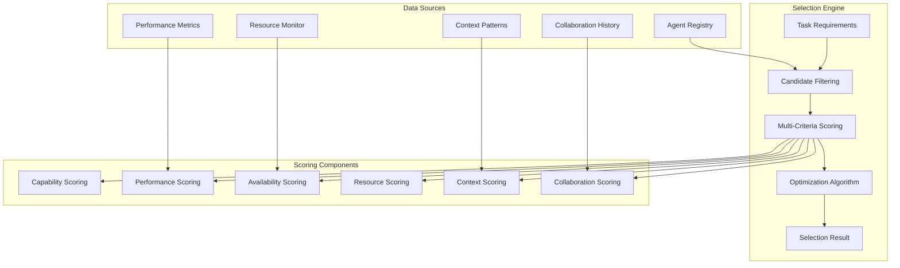

# Context-Aware Agent Selection System

## Overview

The Context-Aware Agent Selection System is a sophisticated multi-criteria decision-making engine that intelligently selects optimal agents for task execution in a multi-agent orchestration environment. It leverages advanced scoring algorithms, performance metrics, and collaborative history to make informed selection decisions.

## Architecture



## Core Components

### 1. Task Requirements

Defines the criteria for agent selection:

```python
@dataclass
class TaskRequirements:
    task_context: TaskContext                    # Type of task (PRD, analysis, etc.)
    required_capabilities: List[CapabilityType] # Required agent capabilities
    complexity_level: ComplexityLevel           # Task complexity
    estimated_tokens: int                       # Token requirements
    max_execution_time: timedelta              # Time constraints
    quality_threshold: float = 0.85           # Quality requirements
    domain_knowledge: List[str] = []           # Domain expertise needed
    preferred_agents: List[AgentType] = []     # Preferred agents
    excluded_agents: List[AgentType] = []      # Agents to exclude
    collaboration_requirements: Dict = {}      # Collaboration needs
```

### 2. Agent Scoring System

Each agent is evaluated using six scoring criteria:

#### Capability Score (Weight: 25%)

Measures how well an agent's capabilities match the task requirements.

**Algorithm:**
```python
async def _calculate_capability_score(agent, requirements) -> float:
    total_score = 0.0
    capability_count = 0
    
    for required_cap in requirements.required_capabilities:
        best_match_score = 0.0
        
        for agent_cap in agent.capabilities:
            if agent_cap.capability_type == required_cap:
                score = agent_cap.proficiency_level
                
                # Complexity bonus
                if requirements.complexity_level in agent_cap.complexity_support:
                    score *= 1.2
                
                # Resource efficiency bonus
                if is_resource_efficient(agent_cap, requirements):
                    score *= 1.1
                
                best_match_score = max(best_match_score, score)
        
        total_score += best_match_score
        capability_count += 1
    
    return min(total_score / max(capability_count, 1), 1.0)
```

**Scoring Factors:**
- **Base Proficiency**: Agent's proficiency level for each capability (0.0-1.0)
- **Complexity Match**: 20% bonus if agent supports required complexity level
- **Resource Efficiency**: 10% bonus for efficient resource usage on small tasks

#### Performance Score (Weight: 20%)

Evaluates historical performance metrics.

**Algorithm:**
```python
async def _calculate_performance_score(agent, requirements) -> float:
    metrics = agent.metrics
    
    # Success rate component (40%)
    success_score = metrics.success_rate
    
    # Response time component (30%)
    target_time = requirements.max_execution_time.total_seconds() * 1000
    time_score = max(0.0, 1.0 - (metrics.average_response_time_ms / target_time))
    
    # Experience component (20%)
    experience_score = min(metrics.total_executions / 100, 1.0)
    
    # Confidence component (10%)
    confidence_score = sum(metrics.confidence_scores) / len(metrics.confidence_scores)
    
    return (success_score * 0.4 + time_score * 0.3 + 
            experience_score * 0.2 + confidence_score * 0.1)
```

**Scoring Factors:**
- **Success Rate**: Historical task success percentage
- **Response Time**: Speed relative to task time constraints
- **Experience**: Number of completed tasks (capped at 100)
- **Confidence**: Average confidence scores from previous tasks

#### Availability Score (Weight: 15%)

Assesses current agent availability and load.

**Algorithm:**
```python
async def _calculate_availability_score(agent) -> float:
    if not agent.is_available:
        return 0.0
    
    # Check concurrent instances
    availability = resource_monitor.get_agent_availability(agent.agent_type)
    
    # Experimental agent penalty
    if agent.is_experimental:
        availability *= 0.8
    
    return availability
```

**Scoring Factors:**
- **Base Availability**: Whether agent is currently available
- **Concurrent Instances**: Available instances vs. maximum concurrent limit
- **Experimental Status**: 20% penalty for experimental agents

#### Resource Score (Weight: 15%)

Evaluates resource efficiency under current system load.

**Algorithm:**
```python
async def _calculate_resource_score(agent, requirements) -> float:
    resource_pressure = resource_monitor.get_resource_pressure()
    resource_score = 1.0
    
    for capability in agent.capabilities:
        if capability.capability_type in requirements.required_capabilities:
            cost_factor = {
                ResourceRequirement.LOW: 0.9,
                ResourceRequirement.MEDIUM: 0.7,
                ResourceRequirement.HIGH: 0.5,
                ResourceRequirement.INTENSIVE: 0.3
            }.get(capability.resource_cost, 0.5)
            
            # Adjust for current pressure
            adjusted_score = cost_factor * (1.0 - resource_pressure * 0.5)
            resource_score = min(resource_score, adjusted_score)
    
    return max(resource_score, 0.1)
```

**Scoring Factors:**
- **Resource Cost**: Agent's resource requirements (LOW to INTENSIVE)
- **System Pressure**: Current CPU/memory utilization impact
- **Capability-Specific**: Different costs for different capabilities

#### Context Score (Weight: 15%)

Measures specialization for the specific task context.

**Algorithm:**
```python
async def _calculate_context_score(agent, requirements) -> float:
    context_patterns = self.context_patterns.get(requirements.task_context, {})
    score = 0.5  # Base score
    
    # Preferred capabilities match
    preferred_caps = context_patterns.get("preferred_capabilities", [])
    agent_caps = [cap.capability_type for cap in agent.capabilities]
    
    matching_caps = len(set(preferred_caps).intersection(set(agent_caps)))
    if preferred_caps:
        score += (matching_caps / len(preferred_caps)) * 0.3
    
    # Domain alignment
    context_domains = get_context_domains(requirements.task_context)
    agent_domains = set(tag.lower() for tag in agent.tags)
    domain_overlap = len(set(context_domains).intersection(agent_domains))
    
    if context_domains:
        score += (domain_overlap / len(context_domains)) * 0.2
    
    return min(score, 1.0)
```

**Scoring Factors:**
- **Capability Preference**: Match with context-preferred capabilities
- **Domain Alignment**: Agent tags matching task context domains
- **Specialization Bonus**: Extra points for high specialization

#### Collaboration Score (Weight: 10%)

Evaluates compatibility with preferred agents and collaboration history.

**Algorithm:**
```python
async def _calculate_collaboration_score(agent, requirements) -> float:
    if not requirements.preferred_agents:
        return 0.5  # Neutral if no collaboration context
    
    collaboration_scores = []
    
    for preferred_agent in requirements.preferred_agents:
        if preferred_agent == agent.agent_type:
            collaboration_scores.append(1.0)  # Perfect self-match
            continue
        
        # Historical collaboration performance
        pair_key = (agent.agent_type, preferred_agent)
        reverse_pair_key = (preferred_agent, agent.agent_type)
        
        historical_score = (
            self.collaboration_history.get(pair_key, 0.5) +
            self.collaboration_history.get(reverse_pair_key, 0.5)
        ) / 2
        
        collaboration_scores.append(historical_score)
    
    return sum(collaboration_scores) / len(collaboration_scores)
```

**Scoring Factors:**
- **Self-Match**: Perfect score (1.0) if agent matches preferred agents
- **Historical Performance**: Past collaboration success rates
- **Bidirectional History**: Considers both directions of collaboration

### 3. Selection Optimization

After scoring, the system uses optimization algorithms to select the best combination of agents.

#### Simple Selection (≤ max_agents candidates)

```python
if len(scored_candidates) <= max_agents:
    selected_agents = [score.agent_type for score in scored_candidates]
    confidence = sum(score.confidence for score in scored_candidates) / len(scored_candidates)
```

#### Advanced Selection (> max_agents candidates)

Uses a greedy algorithm with diversity considerations:

```python
selected = []
used_categories = set()

for candidate in scored_candidates:
    if len(selected) >= max_agents:
        break
    
    agent_entry = registry.get_agent(candidate.agent_type)
    
    # Diversity bonus
    category_bonus = 0.0 if agent_entry.category in used_categories else 0.1
    adjusted_score = candidate.total_score + category_bonus
    
    if len(selected) == 0 or adjusted_score > 0.7:
        selected.append(candidate.agent_type)
        used_categories.add(agent_entry.category)
```

**Optimization Factors:**
- **Score Threshold**: Minimum score of 0.7 for additional agents
- **Category Diversity**: Prefer agents from different categories
- **Greedy Selection**: Select highest-scoring available agents first

## Task Context Patterns

The system maintains context-specific patterns for common scenarios:

### PRD Generation
```python
TaskContext.PRD_GENERATION: {
    "preferred_capabilities": [
        CapabilityType.CREATION,
        CapabilityType.STRATEGIC,
        CapabilityType.BUSINESS
    ],
    "collaboration_patterns": ["sequential", "validation"],
    "quality_emphasis": 0.9
}
```

### Technical Analysis
```python
TaskContext.TECHNICAL_ANALYSIS: {
    "preferred_capabilities": [
        CapabilityType.ANALYTICAL,
        CapabilityType.TECHNICAL,
        CapabilityType.VALIDATION
    ],
    "collaboration_patterns": ["parallel", "peer_review"],
    "quality_emphasis": 0.95
}
```

### Content Creation
```python
TaskContext.CONTENT_CREATION: {
    "preferred_capabilities": [
        CapabilityType.CREATION,
        CapabilityType.TEXT_PROCESSING,
        CapabilityType.CREATIVE
    ],
    "collaboration_patterns": ["draft_review", "iterative"],
    "quality_emphasis": 0.85
}
```

## Execution Planning

After agent selection, the system generates execution plans:

### Execution Strategies

1. **Sequential**: Tasks executed one after another
   - Used when: Context patterns prefer "sequential" collaboration
   - Benefits: Clear dependencies, easier error handling
   - Drawbacks: Longer total execution time

2. **Parallel**: Tasks executed simultaneously
   - Used when: No strong dependencies, multiple agents selected
   - Benefits: Faster completion, better resource utilization
   - Drawbacks: Complex coordination, potential conflicts

3. **Pipeline**: Staged execution with overlapping phases
   - Used when: Context patterns prefer "pipeline" collaboration
   - Benefits: Balanced speed and coordination
   - Drawbacks: Complex pipeline management

### Resource Allocation

The system calculates resource requirements:

```python
allocation = {
    "cpu_cores": sum(agent_cpu_requirements),
    "memory_mb": sum(agent_memory_requirements),
    "concurrent_limit": len(selected_agents),
    "estimated_cost": sum(agent_cost_estimates)
}
```

### Time Estimation

Completion time estimation considers:
- Agent average response times
- Complexity multipliers
- Execution strategy (sequential vs. parallel)
- Historical performance data

```python
complexity_multiplier = {
    ComplexityLevel.SIMPLE: 0.5,
    ComplexityLevel.MODERATE: 1.0,
    ComplexityLevel.COMPLEX: 2.0,
    ComplexityLevel.EXPERT: 3.0,
    ComplexityLevel.RESEARCH_LEVEL: 5.0
}.get(requirements.complexity_level, 1.0)

estimated_ms = avg_response_time_ms * complexity_multiplier
```

## Performance Monitoring

The system continuously monitors and updates agent performance:

### Metrics Tracking

```python
await selector.update_performance_metrics(
    agent_type=AgentType.DRAFT_AGENT,
    execution_time_ms=2500,
    success=True,
    quality_score=0.92
)
```

### Collaboration History

```python
await selector.update_collaboration_history(
    agent_pairs=[(AgentType.DRAFT_AGENT, AgentType.JUDGE_AGENT)],
    success_rate=0.95
)
```

Updates use exponential moving average:
```python
alpha = 0.1  # Learning rate
new_score = (1 - alpha) * current_score + alpha * success_rate
```

## API Integration

The system provides REST API endpoints for integration:

### Agent Selection
```
POST /agent-selection/select
```

### Workflow Creation
```
POST /agent-selection/workflows/create
```

### Task Addition
```
POST /agent-selection/workflows/tasks/add
```

### Performance Updates
```
POST /agent-selection/performance/update
```

## Configuration

### Selection Weights

Default weights can be customized:

```python
selection_weights = {
    SelectionCriteria.CAPABILITY_MATCH: 0.25,        # 25%
    SelectionCriteria.PERFORMANCE_HISTORY: 0.20,     # 20%
    SelectionCriteria.RESOURCE_EFFICIENCY: 0.15,     # 15%
    SelectionCriteria.AVAILABILITY: 0.15,            # 15%
    SelectionCriteria.SPECIALIZATION: 0.15,          # 15%
    SelectionCriteria.COLLABORATIVE_AFFINITY: 0.10   # 10%
}
```

### System Resources

Resource monitoring configuration:

```python
class SystemResourceMonitor:
    def __init__(self):
        self.max_concurrent_per_agent = 3
        self.cpu_threshold = 0.8
        self.memory_threshold = 0.8
        self.pressure_calculation_interval = 60  # seconds
```

## Error Handling

The system includes comprehensive error handling:

### Common Errors

1. **No Candidates Found**
   ```python
   raise ValueError("No suitable candidate agents found for requirements")
   ```

2. **Uninitialized Selector**
   ```python
   raise RuntimeError("Agent selector not initialized")
   ```

3. **Resource Constraints**
   ```python
   raise RuntimeError(f"Agent {agent_type.value} not available within timeout")
   ```

### Fallback Strategies

- **Alternative Agents**: System provides fallback options
- **Relaxed Constraints**: Automatically adjusts requirements if no matches
- **Graceful Degradation**: Returns partial results with warnings

## Best Practices

### For Developers

1. **Initialize Properly**: Always call `await selector.initialize()` before use
2. **Handle Errors**: Implement proper error handling for all selection operations
3. **Monitor Performance**: Regularly update agent performance metrics
4. **Use Context**: Specify appropriate task contexts for better selection
5. **Set Realistic Requirements**: Balance requirements with available agents

### For Agent Implementers

1. **Accurate Capabilities**: Define precise capability types and proficiency levels
2. **Resource Awareness**: Specify realistic resource requirements
3. **Performance Reporting**: Report accurate execution times and success rates
4. **Domain Tags**: Use relevant tags for better context matching
5. **Collaboration**: Design agents to work well with others

### For System Administrators

1. **Monitor Resource Usage**: Keep track of system resource pressure
2. **Update Collaboration History**: Regularly update agent collaboration data
3. **Adjust Weights**: Fine-tune selection weights based on system performance
4. **Agent Registry Maintenance**: Keep agent registry up-to-date
5. **Performance Analysis**: Analyze selection effectiveness and optimize

## Metrics and Analytics

### Key Performance Indicators

1. **Selection Accuracy**: How often selected agents successfully complete tasks
2. **Resource Utilization**: Efficiency of resource allocation
3. **Response Time**: Speed of agent selection process
4. **Collaboration Success**: Success rate of multi-agent collaborations
5. **System Throughput**: Number of successful selections per unit time

### Monitoring Dashboard

The system provides metrics for monitoring:

```python
{
    "selection_requests": 1250,
    "successful_selections": 1187,
    "average_selection_time_ms": 145,
    "average_confidence_score": 0.847,
    "top_performing_agents": [...],
    "resource_utilization": {
        "cpu": 0.67,
        "memory": 0.54
    }
}
```

## Future Enhancements

### Planned Features

1. **Machine Learning Integration**: ML-based scoring improvements
2. **Dynamic Weight Adjustment**: Automatic weight optimization
3. **Advanced Collaboration Patterns**: More sophisticated collaboration strategies
4. **Real-time Load Balancing**: Dynamic resource allocation
5. **Predictive Selection**: Anticipate future agent needs
6. **Cross-Domain Learning**: Learn from selections across different domains

### Research Areas

1. **Multi-Objective Optimization**: Advanced optimization algorithms
2. **Reinforcement Learning**: Agent selection based on RL
3. **Graph-Based Selection**: Network-based agent relationships
4. **Federated Learning**: Distributed performance learning
5. **Semantic Matching**: NLP-based capability matching

## Conclusion

The Context-Aware Agent Selection System provides a robust, scalable solution for intelligent agent selection in multi-agent environments. By combining multiple scoring criteria, performance monitoring, and sophisticated optimization algorithms, it ensures optimal agent selection for various task contexts and requirements.

The system's modular architecture allows for easy extension and customization while maintaining high performance and reliability. Regular monitoring and updates ensure continuous improvement in selection accuracy and system performance.