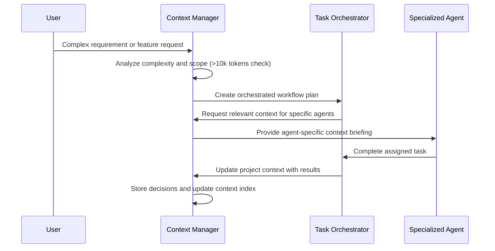

## title: Claude Version: "3.1" Author: Jatinder Grewal

# CLAUDE.md: AI Assistant Integration Guide for AI-Powered Strategic Planning Platform

## Executive Summary

This guide optimizes Claude's capabilities for the AI-Powered Strategic Planning Platform, providing
structured patterns for technical implementation, strategic decision-making, and operational
excellence. The platform combines Nuxt.js 4 frontend with Python FastAPI backend, leveraging Neo4j
GraphRAG and Microsoft's GraphRAG framework for hallucination-free PRD generation and strategic
planning.

**Key Value Drivers:**

- **Planning Acceleration**: 80% reduction in strategic planning cycles (weeks to hours)
- **Hallucination Prevention**: <2% false positive rate through GraphRAG validation
- **Enterprise Scale**: Support for 100+ concurrent users with sub-200ms response times
- **Quality Assurance**: 90% stakeholder satisfaction through AI-human collaboration

## Multi-Agent Architecture & Workflow

### Agent Hierarchy & Coordination

The platform employs a sophisticated multi-agent system coordinated by the **Context Manager**
(Claude Opus) to ensure coherent, scalable development and maintenance processes.

```
┌──────────────────────────────────────────────────────────────────────────┐
│                        CONTEXT MANAGER (Opus)                           │
│  ┌─────────────────────────────────────────────────────────────────────┐ │
│  │  • Maintains project state across sessions                          │ │
│  │  • Coordinates agent interactions                                   │ │
│  │  • Manages context distribution and memory                          │ │
│  │  │  • Creates agent-specific briefings                              │ │
│  │  • Tracks dependencies and integration points                       │ │
│  └─────────────────────────────────────────────────────────────────────┘ │
└──────────────────────────┬───────────────────────────────────────────────┘
                           │
        ┌──────────────────┼──────────────────┐
        │                  │                  │
        ▼                  ▼                  ▼
┌─────────────┐    ┌─────────────┐    ┌─────────────┐
│  PLANNING   │    │ TECHNICAL   │    │ OPERATIONS  │
│  AGENTS     │    │ AGENTS      │    │ AGENTS      │
└─────────────┘    └─────────────┘    └─────────────┘
        │                  │                  │
        ▼                  ▼                  ▼
```

### Specialized Agent Definitions

#### Planning & Strategy Agents

- **task-orchestrator.md**: Orchestrates complex multi-step workflows across agents
- **task-executor.md**: Executes individual tasks with proper error handling and reporting
- **prompt-engineer.md**: Optimizes prompts for GraphRAG and LLM interactions

#### Technical Development Agents

- **ai-engineer.md**: Specializes in GraphRAG implementation, LLM integration, and hallucination
  prevention
- **backend-architect.md**: Designs and implements FastAPI services, API contracts, and system
  architecture
- **frontend-developer.md**: Develops Nuxt.js 4 components, TypeScript implementations, and UI
  interactions
- fullstack
- **database-admin.md**: Manages Neo4j operations, query optimization, and data modeling
- **data-engineer.md**: Handles data pipelines, ETL processes, and integration workflows
- **search-specialist.md**: Implements and optimizes search functionality and GraphRAG queries

#### Infrastructure & Operations Agents

- **cloud-architect.md**: Designs cloud infrastructure, scalability, and deployment strategies
- **deployment-engineer.md**: Manages CI/CD pipelines, containerization, and production deployments
- **ui-ux-designer.md**: Creates design systems, user experience flows, and accessibility standards

### Agent Coordination Workflow

#### 1. Task Initiation Process



#### 2. Context Distribution Strategy

**Quick Context Distribution** (< 500 tokens per agent):

```
For each specialized agent, Context Manager provides:
- Current task objective
- Relevant architectural constraints
- Integration points with other components
- Immediate dependencies and blockers
```

**Full Context Distribution** (< 2000 tokens for complex tasks):

```
Extended context includes:
- Complete architectural overview
- Historical design decisions affecting current task
- Performance requirements and constraints
- Quality standards and validation requirements
```

### Agent Integration Patterns

#### Pattern 1: Frontend Development Flow

```
Context Manager → frontend-developer.md
├── Provides: UI requirements, design system tokens
├── Coordinates with: ui-ux-designer.md (design standards)
├── Integrates with: backend-architect.md (API contracts)
└── Validates with: task-executor.md (testing requirements)
```

#### Pattern 2: GraphRAG Implementation Flow

```
Context Manager → ai-engineer.md
├── Coordinates with: database-admin.md (Neo4j optimization)
├── Integrates with: search-specialist.md (query performance)
├── Validates with: prompt-engineer.md (LLM integration)
└── Deploys with: deployment-engineer.md (production setup)
```

#### Pattern 3: Full-Stack Feature Development

```
Context Manager → task-orchestrator.md
├── Plans: Multi-agent coordination
├── Delegates to:
│   ├── backend-architect.md (API design)
│   ├── frontend-developer.md (UI components)
│   ├── database-admin.md (data layer)
│   └── ai-engineer.md (AI integration)
├── Coordinates: Integration testing
└── Manages: Context updates and documentation
```

### Memory Management & Context Persistence

#### Context Manager Responsibilities

1. **Session Continuity**: Maintain context across development sessions
2. **Agent State Tracking**: Monitor progress and dependencies between agents
3. **Decision Documentation**: Record architectural decisions with rationale
4. **Integration Mapping**: Track how components interact and depend on each other

#### Context Storage Hierarchy

```
┌─────────────────────────────────────────────┐
│            ACTIVE CONTEXT                   │
│  ┌─────────────────────────────────────────┐│
│  │  Current Sprint (Rolling 7-day window) ││
│  │  • Active tasks and blockers            ││
│  │  • Recent decisions                     ││
│  │  • Integration points                   ││
│  └─────────────────────────────────────────┘│
└─────────────────────────────────────────────┘
┌─────────────────────────────────────────────┐
│           PROJECT CONTEXT                   │
│  ┌─────────────────────────────────────────┐│
│  │  Architecture & Standards               ││
│  │  • Design patterns                      ││
│  │  • Performance benchmarks               ││
│  │  • Quality standards                    ││
│  └─────────────────────────────────────────┘│
└─────────────────────────────────────────────┘
┌─────────────────────────────────────────────┐
│          ARCHIVED CONTEXT                   │
│  ┌─────────────────────────────────────────┐│
│  │  Historical Knowledge                    ││
│  │  • Resolved issues and solutions        ││
│  │  • Pattern library                      ││
│  │  • Performance benchmarks               ││
│  └─────────────────────────────────────────┘│
└─────────────────────────────────────────────┘
```

## Project Context & Claude's Role

### System Architecture Overview

```
┌───────────────────────────────────────────────────────────────────────────┐
│             Nuxt.js 4 Frontend                       │
│  ┌────────────┬────────────┬────────────────────────┐  │
│  │    Auth    │  Dashboard │  PRD Workflow UI       │  │
│  │  (JWT/RBAC)│  (Metrics) │  (Conversational)     │  │
│  └────────────┴────────────┴────────────────────────┘  │
└────────────────────────────────────┬──────────────────────────┘
                          │ HTTPS/REST API
┌────────────────────────────────────┴──────────────────────────┐
│           FastAPI Gateway + Services                 │
│  ┌──────────────┬─────────────┬────────────────────┐  │
│  │  Planning    │  GraphRAG   │    Document        │  │
│  │  Pipeline    │  Validator  │   Generator        │  │
│  └──────────────┴─────────────┴────────────────────┘  │
└────────────────────────────────────┬──────────────────────────┘
                          │
┌────────────────────────────────────┴──────────────────────────┐
│              Data & Intelligence Layer               │
│  ┌──────────────┬─────────────┬────────────────────┐  │
│  │ Neo4j Graph  │  LlamaIndex │  OpenRouter/       │  │
│  │ (BRDs/TRDs)  │  (RAG)      │  Multi-LLM         │  │
│  └──────────────┴─────────────┴────────────────────┘  │
└───────────────────────────────────────────────────────────────┘
```

**Claude's Integration Points:**

- Conversational AI workflow optimization
- GraphRAG validation logic implementation
- Nuxt.js 4 component development with TypeScript
- Design system implementation (ink/indigo theme)
- Hallucination prevention strategies
- Performance optimization and monitoring

## PRD Creation Workflow Support

### Phase 0: Project Invitation

```
Implement Phase 0 UI for PRD creation:
Component: Nuxt.js 4 with Nuxt UI/Reka UI
Design: Clean interface, central input field
Requirements:
- Multi-line textarea with placeholder examples
- Tailwind CSS with custom black scale
- TypeScript with full type safety
- Pinia state management integration

Generate Vue 3 Composition API component with:
<template>
  <!-- Clean, focused design following ink/indigo theme -->
</template>
<script setup lang="ts">
  // Composition API with TypeScript
</script>
```

### Phase 1: Objective Clarification

```
Generate clarifying questions logic:
Context: User input from Phase 0
Output: 3-5 targeted questions

Requirements:
- Business problem identification
- Target audience definition
- Technical constraints discovery
- Success metrics definition
- GraphRAG validation for each question

Provide FastAPI endpoint + Nuxt component:
- Real-time validation against Neo4j
- Individual input fields per question
- Progress tracking in Pinia store
```

### Phase 2: Objective Drafting & Approval

```
Implement SMART objective generation:
Input: Phase 0 description + Phase 1 answers
Process: LLM generation → GraphRAG validation → User refinement

Components needed:
1. Rich text editor (Nuxt UI)
2. Edit & Refine interaction flow
3. GraphRAG confidence scoring display
4. Accept & Continue state management

Include confidence visualization (0-100% scale)
```

### Phase 3: Section-by-Section Co-Creation

```
Build iterative section creation workflow:
Sections: Scope, Deliverables, Timeline, Stakeholders, Budget, KPIs, Risks

Pattern for each section:
1. Clarify (context-aware questions)
2. Draft (LLM generation)
3. Edit (rich text editor)
4. Approve (validation + storage)

Requirements:
- Persistent "Project Spine" sidebar
- Section completion tracking
- Ability to revisit approved sections
- GraphRAG validation at each step
```

### Phase 4: Synthesis & Finalization

```
Generate complete document assembly:
Inputs: All approved sections
Output formats: PDF, Word, Markdown

Implementation:
- Document template engine
- Export service with formatting
- Next actions suggestion engine
- Stakeholder sharing functionality

Include WBS generation triggers
```

## Agent-Specific Interaction Patterns

### 1. Frontend Development (frontend-developer.md)

**Component Generation Template:**

```
Create Nuxt.js 4 component for Strategic Planning Platform:
Purpose: [specific functionality]
Design System: Ink/indigo theme with custom black scale
Requirements:
- Vue 3 Composition API with <script setup>
- TypeScript with proper typing
- Nuxt UI/Reka UI components
- Tailwind CSS with theme variables
- Pinia store integration
- Accessibility (WCAG 2.1 AA)

Include complete implementation with tests.
```

### 2. Backend Architecture (backend-architect.md)

**API Endpoint Pattern:**

```
Create FastAPI endpoint for planning platform:
Function: [specific capability]
Authentication: JWT with RBAC
Integration: Neo4j + LlamaIndex + OpenRouter

Requirements:
- Async/await patterns
- Pydantic validation
- Rate limiting (configurable)
- Circuit breaker pattern
- OpenTelemetry tracing
- GraphRAG validation hooks

Include tests and error handling.
```

### 3. AI Engineering (ai-engineer.md)

**GraphRAG Implementation:**

```
Implement GraphRAG validation for PRD generation:
Stage: [Entity/Community/Global validation]
Context: Microsoft GraphRAG + Neo4j

Requirements:
- Hierarchical community detection
- Multi-level validation (98% reduction target)
- Confidence scoring
- Provenance tracking
- Sub-500ms query performance

Provide Python implementation with Neo4j queries.
```

### 4. Database Administration (database-admin.md)

**Neo4j Query Optimization:**

```
Optimize Neo4j query for GraphRAG:
Current query: [paste query]
Vector index: 1536 dimensions, cosine similarity
Performance target: <200ms p95
Scale: Millions of requirements

Provide:
- Optimized Cypher query
- Index recommendations
- Connection pooling config
- Caching strategy
```

### 5. UI/UX Design (ui-ux-designer.md)

**Design System Implementation:**

```
Implement design token for platform:
Token type: [color/spacing/typography]
Values:
  - Black scale: #f7f7f7 to #1a1a1a
  - Semantic: indigo-500, emerald-500, etc.
Requirements:
- CSS variables in theme.css
- Tailwind config extension
- Dark mode support
- Component variants (solid/soft/outline/ghost)

Generate with proper inheritance and overrides.
```

### 6. Task Orchestration (task-orchestrator.md)

**Multi-Agent Workflow:**

```
Orchestrate feature development:
Feature: [specific feature name]
Agents involved: [list required agents]
Dependencies: [technical and business dependencies]

Workflow:
1. Context preparation by Context Manager
2. Parallel agent task assignment
3. Integration checkpoint validation
4. Quality assurance and testing
5. Context update and documentation

Include timeline and success criteria.
```

## Implementation Phases & Timeline

### Phase 1: MVP Foundation (12 Weeks - Q1 2025)

**Core Features:**

- Single document type (PRD generation only)
- 3-phase simplified workflow (Concept → Clarification → Generation)
- Basic GraphRAG integration (Entity validation)
- JWT authentication with basic RBAC
- PDF/Word export functionality

**Agent Responsibilities:**

- **Context Manager**: Project setup and agent coordination
- **task-orchestrator**: MVP workflow planning
- **backend-architect**: Core API foundation
- **frontend-developer**: Basic UI components
- **ai-engineer**: GraphRAG MVP implementation

**Success Criteria:**

- Generate 80% accurate PRDs in <10 minutes
- Support 25 concurrent users
- <5% hallucination rate
- 60% pilot group adoption

### Phase 2: Enhanced Platform (8 Weeks - Q2 2025)

**Enhanced Features:**

- Multiple document types (Project Charters, Task Lists)
- Full GraphRAG implementation with confidence scoring
- Template system with AI compliance
- Real-time collaboration features
- <2% hallucination rate achievement

**Additional Agent Integration:**

- **search-specialist**: Advanced search capabilities
- **data-engineer**: Enhanced data pipelines
- **prompt-engineer**: Optimized LLM interactions

**Success Criteria:**

- Support 100 concurrent users
- 95% accuracy with <2% hallucination
- 90% user satisfaction scores

### Phase 3: Enterprise Integration (8 Weeks - Q3 2025)

**Enterprise Features:**

- Advanced RBAC with SSO integration
- REST API for third-party integrations
- Advanced analytics dashboards
- Production monitoring and observability
- 99.9% uptime SLA

**Full Agent Ecosystem:**

- **cloud-architect**: Enterprise infrastructure
- **deployment-engineer**: Production deployments
- **database-admin**: Performance optimization
- **task-executor**: Automated testing and validation

**Success Criteria:**

- Support 500+ concurrent users
- Enterprise security compliance
- Production deployment successful

## Quality Assurance & Testing

### Agent-Coordinated Testing Strategy

**Context Manager Oversight:**

```
Coordinate testing across agents:
Test Types:
- Unit tests (per agent responsibility)
- Integration tests (multi-agent workflows)
- E2E tests (complete user journeys)
- Performance tests (scalability validation)
- Security tests (vulnerability assessment)

Agent Assignments:
- frontend-developer: Component and UI tests
- backend-architect: API and service tests
- ai-engineer: GraphRAG validation tests
- database-admin: Query performance tests
- deployment-engineer: Infrastructure tests
```

## Success Metrics & KPIs

### Technical Performance

- **Page Load**: <2 seconds initial load
- **API Response**: <200ms for simple queries
- **GraphRAG Validation**: <500ms for complex traversals
- **Document Generation**: <60 seconds for complete PRD
- **Concurrent Users**: 100+ with stable performance
- **Uptime**: 99.9% availability SLA

### Agent Coordination Metrics

- **Context Accuracy**: >95% relevant context distribution
- **Agent Response Time**: <30 seconds for standard tasks
- **Multi-Agent Workflow**: <2 hours for complex features
- **Context Persistence**: Zero context loss across sessions
- **Agent Utilization**: >80% efficient task distribution

### Business Impact

- **Planning Time**: 80% reduction (weeks to hours)
- **Document Quality**: 90% stakeholder satisfaction
- **Hallucination Rate**: <2% false positives
- **Adoption Rate**: 50% of projects within 6 months
- **ROI**: 3x return within first year

## References & Integration Points

**Agent System Documentation**:

- @.claude/agents/README.md - Complete agent index and usage guide
- @.claude/agents/CLAUDE.md - Multi-agent system architecture and coordination patterns

**Core Orchestration Agents**:

- @.claude/agents/context-manager.md - Central coordination hub for multi-agent workflows
- @.claude/agents/task-orchestrator.md - Task Master workflow coordination with parallel execution
- @.claude/agents/task-executor.md - Individual task execution with error handling
- @.claude/agents/task-checker.md - Quality validation and completion verification
- @.claude/agents/prompt-engineer.md - LLM prompt optimization and GraphRAG integration

**Development Agents**:

- @.claude/agents/ai-engineer.md - GraphRAG implementation and hallucination prevention
- @.claude/agents/backend-architect.md - API design and microservices architecture
- @.claude/agents/backend-developer.md - Scalable server-side development
- @.claude/agents/frontend-developer.md - Modern UI development with Nuxt.js 4
- @.claude/agents/fullstack-developer.md - End-to-end feature development
- @.claude/agents/typescript-pro.md - Advanced TypeScript development
- @.claude/agents/vue-expert.md - Vue.js 3 and Nuxt 3 specialization

**Infrastructure & Operations Agents**:

- @.claude/agents/cloud-architect.md - Multi-cloud infrastructure design
- @.claude/agents/hybrid-cloud-architect.md - Hybrid cloud and OpenStack integration
- @.claude/agents/kubernetes-architect.md - Container orchestration and cloud-native patterns
- @.claude/agents/deployment-engineer.md - CI/CD pipelines and production deployments
- @.claude/agents/devops-troubleshooter.md - Production debugging and system reliability
- @.claude/agents/terraform-specialist.md - Infrastructure as Code automation
- @.claude/agents/incident-responder.md - Critical incident management
- @.claude/agents/network-engineer.md - Network connectivity and performance

**Data & AI Specialists**:

- @.claude/agents/database-admin.md - Neo4j and PostgreSQL administration
- @.claude/agents/database-optimizer.md - Query optimization and performance tuning
- @.claude/agents/postgres-pro.md - PostgreSQL expertise and optimization
- @.claude/agents/data-engineer.md - ETL pipelines and data architecture
- @.claude/agents/data-scientist.md - Data analysis and machine learning workflows
- @.claude/agents/llm-architect.md - Large language model architecture and deployment
- @.claude/agents/ml-engineer.md - ML model development and deployment
- @.claude/agents/mlops-engineer.md - ML pipeline automation and lifecycle management

**Quality & Security Agents**:

- @.claude/agents/security-auditor.md - Vulnerability assessment and compliance
- @.claude/agents/code-reviewer.md - Code quality and best practices validation
- @.claude/agents/test-automator.md - Comprehensive testing strategy and automation
- @.claude/agents/performance-engineer.md - Performance optimization and monitoring
- @.claude/agents/debugger.md - Bug investigation and error resolution
- @.claude/agents/error-detective.md - Log analysis and pattern recognition

**Design & User Experience**:

- @.claude/agents/ui-designer.md - Visual design and interface creation
- @.claude/agents/ui-ux-designer.md - Comprehensive user experience design

**Language Specialists**:

- @.claude/agents/python-pro.md - Advanced Python development and optimization
- @.claude/agents/javascript-pro.md - Modern JavaScript and Node.js development
- @.claude/agents/golang-pro.md - Go concurrency and microservices patterns
- @.claude/agents/rust-pro.md - Systems programming with Rust
- @.claude/agents/java-pro.md - Enterprise Java development
- @.claude/agents/csharp-pro.md - .NET development with C#
- @.claude/agents/php-pro.md - Modern PHP frameworks and optimization
- @.claude/agents/ruby-pro.md - Ruby on Rails development and testing
- @.claude/agents/c-pro.md - Systems programming with C
- @.claude/agents/cpp-pro.md - Modern C++ development
- @.claude/agents/elixir-pro.md - Functional programming with Elixir
- @.claude/agents/scala-pro.md - Enterprise Scala with functional patterns
- @.claude/agents/sql-pro.md - Advanced SQL and database design

**Documentation & Communication**:

- @.claude/agents/docs-architect.md - Technical documentation and architecture guides
- @.claude/agents/tutorial-engineer.md - Educational content and onboarding materials
- @.claude/agents/reference-builder.md - API references and technical specifications
- @.claude/agents/api-documenter.md - API documentation and SDK generation
- @.claude/agents/mermaid-expert.md - Diagrams and visual documentation

**Business & Analytics**:

- @.claude/agents/business-analyst.md - Metrics analysis and KPI tracking
- @.claude/agents/content-marketer.md - Marketing content and growth strategies
- @.claude/agents/customer-support.md - Support documentation and help systems
- @.claude/agents/sales-automator.md - Sales process automation
- @.claude/agents/hr-pro.md - HR processes and policy development
- @.claude/agents/legal-advisor.md - Legal documentation and compliance

**Specialized Domains**:

- @.claude/agents/unity-developer.md - Game development with Unity engine
- @.claude/agents/flutter-expert.md - Cross-platform mobile development
- @.claude/agents/ios-developer.md - Native iOS development
- @.claude/agents/mobile-developer.md - React Native and cross-platform apps
- @.claude/agents/wordpress-master.md - WordPress development and customization
- @.claude/agents/minecraft-bukkit-pro.md - Minecraft server plugin development
- @.claude/agents/payment-integration.md - Payment processing and e-commerce
- @.claude/agents/quant-analyst.md - Financial modeling and trading algorithms
- @.claude/agents/risk-manager.md - Risk assessment and mitigation
- @.claude/agents/legacy-modernizer.md - Legacy system modernization
- @.claude/agents/refactoring-specialist.md - Code refactoring and technical debt
- @.claude/agents/search-specialist.md - Advanced research and information gathering
- @.claude/agents/dx-optimizer.md - Developer experience optimization

**SEO & Marketing Specialists**:

- @.claude/agents/seo-content-writer.md - SEO-optimized content creation
- @.claude/agents/seo-content-auditor.md - Content quality and E-E-A-T analysis
- @.claude/agents/seo-keyword-strategist.md - Keyword research and optimization
- @.claude/agents/seo-meta-optimizer.md - Meta tags and SERP optimization
- @.claude/agents/seo-structure-architect.md - Content structure and schema markup
- @.claude/agents/seo-snippet-hunter.md - Featured snippet optimization
- @.claude/agents/seo-content-planner.md - Content strategy and planning
- @.claude/agents/seo-content-refresher.md - Content updates and freshness
- @.claude/agents/seo-authority-builder.md - Authority signals and E-E-A-T
- @.claude/agents/seo-cannibalization-detector.md - Keyword overlap detection

**Implementation Documentation**:

- @docs/implementation_runbook.md
- @docs/ui-ux-requirements.md
- @docs/PRD.md
- @docs/RAG_strategy.md
- @docs/project_charter.md
- @docs/product-roadmap.md
- @input/01-Project-overview.md

**Task Master Integration**:

- @./.taskmaster/CLAUDE.md

See @README for project overview and @package.json for available npm commands for this project.

# Additional Instructions

- git workflow @docs/git-instructions.md

## Conclusion

This enhanced guide establishes Claude as the strategic technical partner within a sophisticated
multi-agent ecosystem for building an enterprise-grade AI-powered strategic planning platform. The
Context Manager ensures coherent coordination across all specialized agents while maintaining
project context and quality standards.

**Critical Success Factors:**

- Context Manager maintains <95% context accuracy across agent interactions
- Specialized agents deliver within defined performance parameters
- Multi-agent workflows complete complex features in <2 hours
- Maintain <2% hallucination rate through coordinated GraphRAG validation
- Achieve enterprise scalability with coordinated infrastructure management

The platform's success depends on seamless agent coordination, consistent context management, and
continuous quality validation across the entire development
