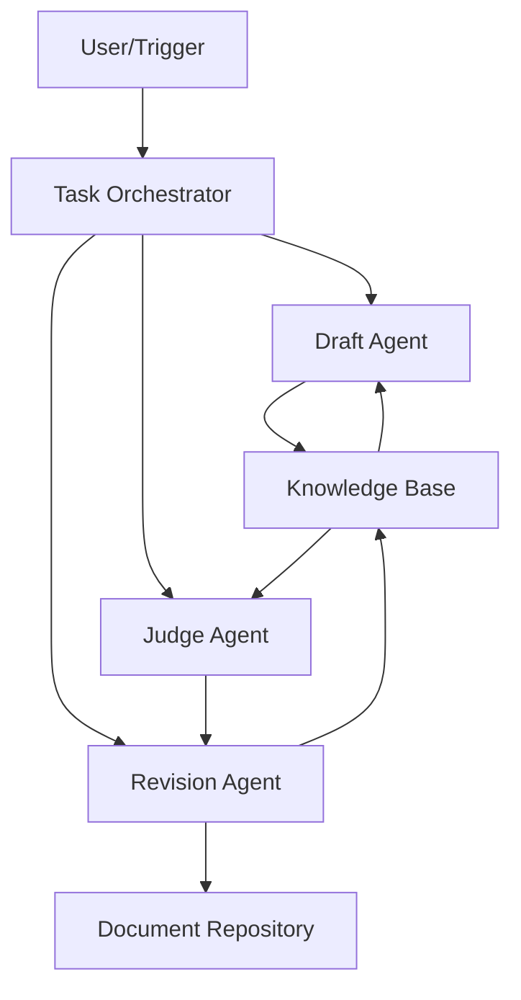

# ⚙️ Technical Requirements Document (TRD)

**Project Title:** AI-Driven Documentation Swarm (ADGS)
**Version:** 1.0
**Date:** July 10, 2025
**Prepared By:** Jatinder Grewal @ 66Nodes

---

## 1. Introduction

This document defines the technical architecture and system-level specifications for the ADGS platform. The goal is to enable seamless orchestration of role-specialized AI agents using CrewAI, empowering them to autonomously produce, validate, and refine structured documentation artifacts.

---

## 2. Target Architecture Overview

### 2.1 Logical Architecture



* **Orchestrator:** Manages agent execution and handoff.
* **Draft Agent:** Produces first draft based on prompts and knowledgebase.
* **Judge Agent:** Validates draft using rule-based and LLM critique logic.
* **Revision Agent:** Refines the document based on structured feedback.
* **Knowledge Base:** Vector + structured storage for semantic document recall.
* **Repository:** Final document store with versioning.

---

## 3. Agent Infrastructure Design

| **Agent**           | **LLM Model**             | **Execution Runtime**           | **Tools/Resources**                               |
| ------------------- | ------------------------- | ------------------------------- | ------------------------------------------------- |
| Draft Agent         | GPT-4 or Claude 3         | Serverless (Docker)             | Persona prompt, semantic context, document schema |
| Judge Agent         | Gemini 1.5 or Claude Opus | Isolated execution (avoid bias) | Validation rules, .mdc specs, scoring rubric      |
| Revision Agent      | GPT-4 (with critique)     | Stateless container             | Judge feedback, critique parser, retry logic      |
| Cursor Expert Agent | GPT-4 Turbo               | Synchronous pipeline            | IDE schema, cursor templates, test harness        |

Each agent is configured with **persona prompts**, access controls, a knowledge window, and its own specialized reasoning profile.

---

## 4. Technology Stack

| **Component**            | **Technology**                     | **Notes**                                          |
| ------------------------ | ---------------------------------- | -------------------------------------------------- |
| Agent Framework          | CrewAI                             | Manages agent lifecycle, task orchestration        |
| LLMs                     | OpenAI (GPT-4), Gemini, Claude 3   | Used across agent personas based on specialization |
| Vector Database          | Milvus                           | Embeds documents and metadata for semantic search  |
| Document Store           | Git-backed file repo (e.g., Gitea) | Markdown, YAML, .mdc storage                       |
| Orchestration Engine     | Python Async + Prefect             | For DAG-based workflows, retries, and logging      |
| Webhooks/API Gateway     | FastAPI                            | For triggering document generation endpoints       |
| Code Rule Compiler       | Cursor IDE .mdc parser             | For rule validation and code scaffolding           |
| Agent Evaluation Harness | Pytest, LangChain Evaluators       | Automated scoring, hallucination detection         |

---

## 5. Data Flow Design

### 5.1 Document Generation Flow

```
Step 1: Trigger via API or CLI
Step 2: Orchestrator initiates Draft Agent
Step 3: Draft Agent fetches relevant context from Milvus
Step 4: Draft Agent writes first draft and submits to Orchestrator
Step 5: Judge Agent receives draft and validates using LLM + rules
Step 6: Judge returns score, highlights, and feedback to Revision Agent
Step 7: Revision Agent edits the document, confirms compliance
Step 8: Orchestrator stores document in repo, updates index and tags
```

### 5.2 Rule-Based Validation Flow

* Rule formats: YAML/JSON
* Template Compliance Check:

  * Title Structure
  * Section Presence
  * Tagging
* Content Validation Check:

  * Relevance of paragraphs
  * Presence of key artifacts (e.g., diagrams, tables)
* Cursor Rule Validation:

  * .mdc rules parsed, dry-run in Cursor IDE engine
  * Syntax and behavior simulation outputs

---

## 6. Modular Design Principles

* **Stateless Agents:** All agents shall be ephemeral; state and logs shall be externalized.
* **Pluggable Models:** LLMs used per agent can be swapped through configuration.
* **Scalable Pipelines:** Each document run can instantiate parallel pipelines.
* **Auditable History:** Every generation step logged and linked to the document commit.
* **Fail-Safe:** Human review fallback after 3 invalidation cycles or critical failure.

---

## 7. Interfaces & APIs

| **Interface**   | **Purpose**                          | **Protocol**     | **Authentication**       |
| --------------- | ------------------------------------ | ---------------- | ------------------------ |
| /generate-doc   | Trigger document creation            | POST (JSON)      | Bearer Token + IP filter |
| /check-status   | Track document status and agent logs | GET              | Task ID                  |
| /repo/documents | Retrieve or list generated documents | GET, POST, PATCH | Role-based read/write    |
| /validate-mdc   | Submit .mdc rules for validation     | POST             | Requires developer token |

---

## 8. Validation and Monitoring

### Automated Metrics

* Linting Score
* Template Completeness (Boolean Matrix)
* Revision Passes (<=3)
* Rule Compliance % (for .mdc and text)

### Logging & Tracing

* Each agent’s interaction is logged with:

  * Input prompt (hashed)
  * Output hash and summary
  * Runtime duration
  * Failure reasons if applicable

### Fallback Conditions

* If Judge score < threshold (e.g., 80%)
* If semantic gap > 30% (measured by embedding drift)
* If .mdc rule file fails cursor dry-run validation

---

## 9. Security & Data Integrity

| **Concern**          | **Mitigation Strategy**                               |
| -------------------- | ----------------------------------------------------- |
| API key leakage      | Environment variable injection + Vault-backed secrets |
| Prompt injection     | Sanitization layer + token filters                    |
| Agent collusion bias | Use of disjoint models for critique vs. generation    |
| Document overwrite   | SHA-based commit with history and rollback            |

---

## 10. Development Environments

* **Local Dev:** Docker Compose (Milvus + Agents + Webhooks)
* **CI/CD:** GitHub Actions or GitLab CI for running unit + integration tests
* **Agent Tuning Sandbox:** JupyterLab + LangChain Prompt Playground

---
