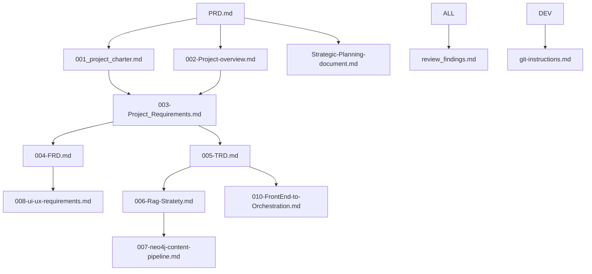

# 📚 AI-Powered Strategic Planning Platform - Documentation Hub

**Last Updated**: January 2025 | **Version**: 2.2.0 | **Status**: Active Development

## 🎯 Documentation Overview

This directory contains comprehensive documentation for the **AI-Powered Strategic Planning Platform**, an enterprise-grade system that transforms strategic planning cycles from weeks to hours through AI-driven conversational workflows. The platform maintains <2% hallucination rate through advanced GraphRAG validation while supporting 100+ concurrent users.

### 🏗️ Platform Architecture
- **Frontend**: Nuxt.js 4 + Vue 3 + TypeScript
- **Backend**: Python FastAPI + Neo4j GraphRAG + PostgreSQL  
- **AI Layer**: OpenRouter multi-LLM integration with 95+ specialized agents
- **Quality Assurance**: GraphRAG-powered hallucination prevention (<2% threshold)
- **Performance**: <200ms API response times, enterprise scalability

### Technology Stack
- **Frontend**: Nuxt.js 4, Vue.js 3, TypeScript, Tailwind CSS
- **Backend**: Python FastAPI, Neo4j GraphRAG, PostgreSQL
- **AI/ML**: OpenRouter/Multi-LLM, Microsoft GraphRAG, Milvus
- **Infrastructure**: Docker, Kubernetes, Prometheus, Grafana

## 📋 Document Catalog

### 🎯 **Core Planning Documents**

| Document | Title | Purpose | Dependencies | Status |
|----------|-------|---------|--------------|--------|
| [**PRD.md**](./PRD.md) | **Product Requirements Document** | Single source of truth - 1073+ lines of comprehensive requirements | None (Master Document) | ✅ **Primary** |
| [001_project_charter.md](./001_project_charter.md) | Project Charter | Executive summary and business objectives | PRD.md | ✅ Complete |
| [002-Project-overview.md](./002-Project-overview.md) | Project Overview | High-level system architecture and scope | Project Charter | ✅ Complete |
| [Strategic-Planning-document.md](./Strategic-Planning-document.md) | Strategic Planning Analysis | Detailed strategic framework and business model | PRD.md, Project Charter | ✅ Complete |
| [Strategic-Plan.md](./Strategic-Plan.md) | Executive Strategic Plan | Executive-level strategic roadmap | Strategic Planning Document | ✅ Complete |
| [product-roadmap.md](./product-roadmap.md) | Product Development Roadmap | Feature delivery timeline and milestones | PRD.md | ✅ Complete |

### 🏗️ **Technical Architecture**

| Document | Title | Purpose | Dependencies | Status |
|----------|-------|---------|--------------|--------|
| [**005-TRD.md**](./005-TRD.md) | **Technical Requirements Document** | Infrastructure foundation and system architecture | PRD.md | ✅ **Critical** |
| [004-FRD.md](./004-FRD.md) | Functional Requirements Specification | Detailed functional requirements and user stories | PRD.md, TRD.md | ✅ Complete |
| [**006-Rag-Stratety.md**](./006-Rag-Stratety.md) | **GraphRAG Strategy** | Hallucination prevention architecture | TRD.md | ✅ **Critical** |
| [007-neo4j-content-pipeline.md](./007-neo4j-content-pipeline.md) | Neo4j Content Pipeline | Graph database integration patterns | RAG Strategy | ✅ Complete |
| [013-milvus-neo4j-hybrid-rag.md](./013-milvus-neo4j-hybrid-rag.md) | Hybrid Vector Database Strategy | Milvus + Neo4j integration architecture | Neo4j Pipeline | ✅ Complete |
| [RAG_strategy.md](./RAG_strategy.md) | RAG Implementation Strategy | Detailed RAG architecture and validation | GraphRAG Strategy | ✅ Complete |
| [openapi.yaml](./openapi.yaml) | OpenAPI Specification | Complete API contract and endpoint definitions | TRD.md | ✅ Complete |

### 💻 **Development & Implementation**

| Document | Title | Purpose | Dependencies | Status |
|----------|-------|---------|--------------|--------|
| [**008-ui-ux-requirements.md**](./008-ui-ux-requirements.md) | **UI/UX Requirements** | Frontend specifications and design system | FRD.md | ✅ **Important** |
| [009-ui-ux-writeup.md](./009-ui-ux-writeup.md) | UI/UX Design Analysis | Detailed design patterns and user experience | UI/UX Requirements | ✅ Complete |
| [**010-FrontEnd-to-Orchestration.md**](./010-FrontEnd-to-Orchestration.md) | **Frontend Integration** | API integration patterns and orchestration | TRD.md, UI/UX Requirements | ✅ **Important** |
| [git-instructions.md](./git-instructions.md) | Git Workflow Guidelines | Development workflow and CI/CD processes | None | ✅ Complete |
| [git-instructions-2.md](./git-instructions-2.md) | Advanced Git Operations | Complex git operations and team workflows | Git Instructions | ✅ Complete |

### 🔍 **Quality Assurance & Analysis**

| Document | Title | Purpose | Dependencies | Status |
|----------|-------|---------|--------------|--------|
| [**review_findings.md**](./review_findings.md) | **Architectural Review Findings** | Known gaps, issues, and recommendations | All Technical Docs | ⚠️ **Review** |
| [**CLAUDE.md**](./CLAUDE.md) | **AI Agent Context** | Context and optimization guide for AI agents | PRD.md, TRD.md | ✅ **Agent Guide** |

---

## 🧭 Document Navigation Guide

### 📖 **New Team Members - Start Here:**
```
1. 📋 PRD.md                           → Business requirements and scope
2. 🏗️ 005-TRD.md                       → Technical architecture foundation  
3. 🎯 006-Rag-Stratety.md               → GraphRAG hallucination prevention
4. 💻 008-ui-ux-requirements.md        → Frontend development guidelines
5. 🔍 review_findings.md                → Known issues and gaps
```

### 🤖 **AI Agent Integration - Priority Reading:**
```
1. 🤖 CLAUDE.md                        → AI agent context and optimization
2. 📋 PRD.md (sections 3-7)            → Core functional requirements  
3. 🏗️ 005-TRD.md (sections 4-6)       → System integration patterns
4. 🎯 006-Rag-Stratety.md              → GraphRAG validation requirements
5. ⚠️ review_findings.md               → Critical architectural gaps
```

### 👨‍💻 **Development Teams - Technical Focus:**
```
Frontend: 008-ui-ux-requirements.md → 009-ui-ux-writeup.md → 010-FrontEnd-to-Orchestration.md
Backend:  005-TRD.md → 006-Rag-Stratety.md → 007-neo4j-content-pipeline.md  
AI/ML:    006-Rag-Stratety.md → RAG_strategy.md → 013-milvus-neo4j-hybrid-rag.md
DevOps:   git-instructions.md → git-instructions-2.md → openapi.yaml
```

### 📊 **Business Stakeholders - Strategic Overview:**
```
Executive:    Strategic-Planning-document.md → Strategic-Plan.md
Product:      PRD.md → product-roadmap.md → 004-FRD.md  
Planning:     001_project_charter.md → 002-Project-overview.md
```

## 🚀 Quick Access Patterns

### **Daily Development Reference**
- **API Contracts**: [openapi.yaml](./openapi.yaml)
- **GraphRAG Integration**: [006-Rag-Stratety.md](./006-Rag-Stratety.md)
- **UI Components**: [008-ui-ux-requirements.md](./008-ui-ux-requirements.md)
- **Known Issues**: [review_findings.md](./review_findings.md)

### **Architecture Decisions**
- **System Design**: [005-TRD.md](./005-TRD.md) → Sections 2-4
- **Data Architecture**: [007-neo4j-content-pipeline.md](./007-neo4j-content-pipeline.md)
- **Integration Patterns**: [010-FrontEnd-to-Orchestration.md](./010-FrontEnd-to-Orchestration.md)

### **Quality Validation**
- **Hallucination Prevention**: [006-Rag-Stratety.md](./006-Rag-Stratety.md) → Section 3
- **Performance Requirements**: [005-TRD.md](./005-TRD.md) → Section 5  
- **Testing Strategies**: [004-FRD.md](./004-FRD.md) → Section 8

## 🔄 Key System Features

### AI-Powered Workflow (4 Phases)
- **Phase 0**: Project Invitation - Capture initial project concept
- **Phase 1**: Objective Clarification - AI-generated targeted questions
- **Phase 2**: Objective Drafting & Approval - SMART objectives with human validation
- **Phase 3**: Section-by-Section Co-Creation - Collaborative document building

### GraphRAG Integration
- **<2% Hallucination Rate** through multi-tier validation
- **Entity Validation** - Individual fact checking
- **Community Validation** - Local context verification  
- **Global Validation** - System-wide consistency

### Performance Targets
- **80% Time Reduction** in strategic planning cycles
- **<200ms API Response Times** (P95)
- **100+ Concurrent Users** with auto-scaling
- **99.9% Uptime SLA** with comprehensive monitoring

## Document Dependencies Graph



## Quality Assurance

### Document Status
- ✅ **Complete**: Ready for implementation
- 🚧 **In Progress**: Under active development  
- ❌ **Missing**: Required but not yet created
- 🔄 **Under Review**: Awaiting validation

### Validation Criteria
All documents must meet:
- **Technical Accuracy**: Verified against implementation requirements
- **Completeness**: All sections populated with actionable details
- **Consistency**: Cross-document references validated
- **Up-to-date**: Reflects current system architecture and business requirements

## Support & Contact

### Document Maintenance
- **Primary Owner**: Development Team Lead
- **Review Cycle**: Monthly architectural reviews
- **Update Process**: Git-based version control with PR reviews
- **Issue Tracking**: GitHub Issues for documentation gaps and improvements

### Getting Help
1. **Technical Questions**: Reference [review_findings.md](review_findings.md) for known issues
2. **Implementation Support**: Follow [git-instructions.md](git-instructions.md) setup procedures
3. **Architecture Decisions**: Consult [005-TRD.md](005-TRD.md) and [PRD.md](PRD.md)

---

**Last Updated**: January 2025  
**Documentation Version**: v2.2.0  
**Project Status**: MVP Development Phase