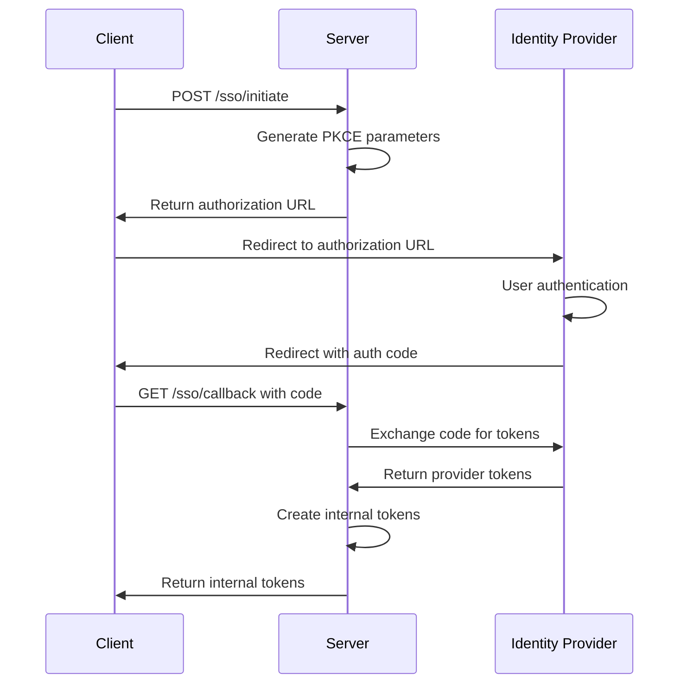

# Enterprise SSO Integration Guide

## Overview

The Strategic Planning Platform provides comprehensive Single Sign-On (SSO) integration with enterprise identity providers including Azure AD (Microsoft Entra ID) and Okta. This guide covers setup, configuration, API usage, and troubleshooting for enterprise authentication flows.

## Table of Contents

1. [Supported Identity Providers](#supported-identity-providers)
2. [Configuration Setup](#configuration-setup)
3. [API Endpoints](#api-endpoints)
4. [Authentication Flows](#authentication-flows)
5. [User Provisioning](#user-provisioning)
6. [Role Mapping](#role-mapping)
7. [Audit and Compliance](#audit-and-compliance)
8. [Integration Examples](#integration-examples)
9. [Troubleshooting](#troubleshooting)
10. [Security Considerations](#security-considerations)

## Supported Identity Providers

### Azure AD (Microsoft Entra ID)
- **OAuth2/OIDC Flow**: Authorization Code with PKCE
- **Scopes**: `openid`, `profile`, `email`, `User.Read`
- **User Info**: Supports roles, groups, and user profile data
- **Token Types**: Access tokens, ID tokens, refresh tokens

### Okta
- **OAuth2/OIDC Flow**: Authorization Code with PKCE  
- **Scopes**: `openid`, `profile`, `email`, `groups`
- **User Info**: Supports groups, user profile, and custom attributes
- **Token Types**: Access tokens, ID tokens, refresh tokens

### Generic OIDC
- Support for any OIDC-compliant identity provider
- Configurable endpoints and scopes
- Custom role mapping capabilities

## Configuration Setup

### Environment Variables

Add the following environment variables to your `.env` file:

```bash
# Azure AD Configuration
AZURE_AD_CLIENT_ID=your_azure_application_client_id
AZURE_AD_CLIENT_SECRET=your_azure_application_client_secret  
AZURE_AD_TENANT_ID=your_azure_tenant_id

# Okta Configuration
OKTA_CLIENT_ID=your_okta_application_client_id
OKTA_CLIENT_SECRET=your_okta_application_client_secret
OKTA_DOMAIN=your-org.okta.com

# Enterprise API Settings
ENABLE_ENTERPRISE_APIS=true
ENTERPRISE_API_TIMEOUT=30
ENTERPRISE_USER_SYNC=true

# Audit and Compliance
AUDIT_LOG_RETENTION_DAYS=90
COMPLIANCE_MODE=enterprise
ENABLE_AUDIT_LOGGING=true
```

### Azure AD Application Registration

1. **Register Application**:
   ```bash
   az ad app create --display-name "Strategic Planning Platform"
   ```

2. **Configure Redirect URIs**:
   - Web: `https://yourdomain.com/api/v1/enterprise/sso/callback/azure_ad`
   - SPA: `https://yourdomain.com/auth/callback`

3. **API Permissions**:
   - Microsoft Graph: `User.Read`, `profile`, `email`, `openid`
   - Optional: `Directory.Read.All` for group information

4. **Authentication Settings**:
   - Enable ID tokens
   - Enable access tokens
   - Configure implicit grant flow if needed

### Okta Application Configuration

1. **Create OIDC App**:
   - Application type: Web Application
   - Grant types: Authorization Code, Refresh Token

2. **Configure URIs**:
   - Sign-in redirect URI: `https://yourdomain.com/api/v1/enterprise/sso/callback/okta`
   - Sign-out redirect URI: `https://yourdomain.com/logout`

3. **Assignments**:
   - Assign appropriate users/groups
   - Configure group claims if using role mapping

## API Endpoints

### Base URL
```
https://yourdomain.com/api/v1/enterprise
```

### Authentication Endpoints

#### Initiate SSO Authentication
```http
POST /sso/initiate
Content-Type: application/json

{
  "provider": "azure_ad",
  "redirect_uri": "https://yourdomain.com/auth/callback",
  "state": "optional_csrf_token"
}
```

**Response:**
```json
{
  "authorization_url": "https://login.microsoftonline.com/...",
  "state": "generated_csrf_token",
  "provider": "azure_ad",
  "expires_in": 600
}
```

#### Handle SSO Callback
```http
GET /sso/callback/{provider}?code=auth_code&state=csrf_token&redirect_uri=callback_url
```

**Response:**
```json
{
  "access_token": "jwt_access_token",
  "refresh_token": "jwt_refresh_token", 
  "token_type": "bearer",
  "expires_in": 1800,
  "user": {
    "id": "internal_user_id",
    "email": "user@company.com",
    "full_name": "John Doe",
    "company": "Acme Corp",
    "role": "user",
    "is_active": true,
    "sso_provider": "azure_ad"
  },
  "provider": "azure_ad"
}
```

### Provider Management

#### List Identity Providers
```http
GET /sso/providers
```

**Response:**
```json
[
  {
    "name": "azure_ad",
    "type": "azure_ad", 
    "scopes": ["openid", "profile", "email", "User.Read"],
    "configured": true
  },
  {
    "name": "okta",
    "type": "okta",
    "scopes": ["openid", "profile", "email", "groups"],
    "configured": true
  }
]
```

#### Get Provider Information
```http
GET /sso/providers/{provider_name}
```

### Enterprise API Integration

#### List Enterprise Projects
```http
GET /enterprise/projects?provider=azure_ad
Authorization: Bearer {access_token}
```

**Response:**
```json
{
  "projects": [
    {
      "id": "proj-001",
      "name": "Customer Portal Redesign",
      "description": "Modernize customer portal with new UI/UX",
      "status": "active",
      "created_date": "2024-01-15",
      "owner": "john.doe@company.com",
      "source": "azure_devops"
    }
  ],
  "total": 1,
  "user": "current.user@company.com",
  "timestamp": "2024-03-15T10:00:00Z"
}
```

#### List Enterprise Users (Admin Only)
```http
GET /enterprise/users?provider=azure_ad&limit=50&offset=0
Authorization: Bearer {admin_access_token}
```

### Audit and Compliance

#### Get Audit Events (Admin Only)
```http
GET /enterprise/audit/events?event_type=sso_authentication_success&limit=100
Authorization: Bearer {admin_access_token}
```

**Response:**
```json
[
  {
    "event_id": "evt_123",
    "event_type": "sso_authentication_success",
    "timestamp": "2024-03-15T10:00:00Z",
    "event_data": {
      "provider": "azure_ad",
      "user_email": "user@company.com",
      "user_id": "user_123"
    }
  }
]
```

#### Get Audit Summary (Admin Only)
```http
GET /enterprise/audit/summary
Authorization: Bearer {admin_access_token}
```

## Authentication Flows

### Authorization Code Flow with PKCE

1. **Initiate Authentication**:
   - Client calls `/sso/initiate` endpoint
   - Server generates authorization URL with PKCE parameters
   - Client redirects user to identity provider

2. **User Authentication**:
   - User authenticates with identity provider
   - Identity provider redirects back with authorization code

3. **Token Exchange**:
   - Client calls `/sso/callback/{provider}` with authorization code
   - Server exchanges code for tokens using PKCE verifier
   - Server creates internal JWT tokens

4. **User Session**:
   - Server returns internal access/refresh tokens
   - Client uses tokens for API authentication

### Sequence Diagram



## User Provisioning

### Automatic User Creation

When a user successfully authenticates via SSO but doesn't exist in our system:

1. **User Information Extraction**:
   - Email address (required)
   - Full name from provider claims
   - Company information if available
   - Role based on provider groups/roles

2. **User Account Creation**:
   - Generate internal user ID
   - Set random password (not used for SSO users)
   - Mark account as active
   - Store SSO provider information

3. **Initial Role Assignment**:
   - Apply role mapping rules
   - Default to 'user' role if no mapping found
   - Log provisioning event for audit

### User Synchronization

For existing users authenticating via SSO:

1. **Profile Updates**:
   - Update last login timestamp
   - Sync profile information if changed
   - Update role if group membership changed

2. **Account Validation**:
   - Ensure account is still active
   - Validate email address matches
   - Check for account lockouts

## Role Mapping

### Azure AD Role Mapping

```json
{
  "Global Administrator": "admin",
  "Application Administrator": "admin", 
  "User": "user",
  "Guest": "viewer"
}
```

### Okta Group Mapping

```json
{
  "Admin": "admin",
  "Manager": "user",
  "User": "user", 
  "Guest": "viewer"
}
```

### Custom Role Mapping

Configure custom role mappings in environment variables:

```bash
# Azure AD Custom Roles
AZURE_AD_ROLE_MAPPING='{"Company Admin":"admin","Project Manager":"user","Read Only":"viewer"}'

# Okta Custom Groups  
OKTA_GROUP_MAPPING='{"Admins":"admin","Power Users":"user","Viewers":"viewer"}'
```

## Integration Examples

### Frontend JavaScript Integration

```javascript
// Initiate SSO authentication
async function initiateSSO(provider) {
  const response = await fetch('/api/v1/enterprise/sso/initiate', {
    method: 'POST',
    headers: {
      'Content-Type': 'application/json'
    },
    body: JSON.stringify({
      provider: provider,
      redirect_uri: `${window.location.origin}/auth/callback`
    })
  });
  
  const data = await response.json();
  
  // Store state for validation
  localStorage.setItem('sso_state', data.state);
  
  // Redirect to identity provider
  window.location.href = data.authorization_url;
}

// Handle callback
async function handleSSOCallback() {
  const urlParams = new URLSearchParams(window.location.search);
  const code = urlParams.get('code');
  const state = urlParams.get('state');
  const provider = urlParams.get('provider') || 'azure_ad';
  
  // Validate state
  const storedState = localStorage.getItem('sso_state');
  if (state !== storedState) {
    throw new Error('Invalid state parameter');
  }
  
  // Exchange code for tokens
  const response = await fetch(`/api/v1/enterprise/sso/callback/${provider}?` + 
    `code=${code}&state=${state}&redirect_uri=${encodeURIComponent(window.location.origin + '/auth/callback')}`);
  
  const data = await response.json();
  
  // Store tokens
  localStorage.setItem('access_token', data.access_token);
  localStorage.setItem('refresh_token', data.refresh_token);
  localStorage.setItem('user', JSON.stringify(data.user));
  
  // Redirect to application
  window.location.href = '/dashboard';
}
```

### Backend Integration (Node.js/Express)

```javascript
const express = require('express');
const axios = require('axios');

const app = express();

// Initiate SSO
app.get('/auth/sso/:provider', async (req, res) => {
  try {
    const response = await axios.post(`${API_BASE}/enterprise/sso/initiate`, {
      provider: req.params.provider,
      redirect_uri: `${req.protocol}://${req.get('host')}/auth/callback`
    });
    
    res.redirect(response.data.authorization_url);
  } catch (error) {
    res.status(500).json({ error: 'SSO initiation failed' });
  }
});

// Handle callback
app.get('/auth/callback', async (req, res) => {
  try {
    const { code, state, provider = 'azure_ad' } = req.query;
    
    const response = await axios.get(`${API_BASE}/enterprise/sso/callback/${provider}`, {
      params: {
        code,
        state,
        redirect_uri: `${req.protocol}://${req.get('host')}/auth/callback`
      }
    });
    
    const { access_token, refresh_token, user } = response.data;
    
    // Set secure cookies
    res.cookie('access_token', access_token, { 
      httpOnly: true, 
      secure: true, 
      maxAge: 30 * 60 * 1000 // 30 minutes
    });
    
    res.cookie('refresh_token', refresh_token, {
      httpOnly: true,
      secure: true, 
      maxAge: 7 * 24 * 60 * 60 * 1000 // 7 days
    });
    
    res.redirect('/dashboard');
  } catch (error) {
    res.status(500).json({ error: 'Authentication failed' });
  }
});
```

### Python Integration

```python
import requests
from flask import Flask, request, redirect, session
import secrets

app = Flask(__name__)
app.secret_key = secrets.token_hex(32)

API_BASE = "https://yourdomain.com/api/v1"

@app.route('/auth/sso/<provider>')
def initiate_sso(provider):
    """Initiate SSO authentication."""
    
    redirect_uri = request.url_root + 'auth/callback'
    
    response = requests.post(f"{API_BASE}/enterprise/sso/initiate", json={
        "provider": provider,
        "redirect_uri": redirect_uri
    })
    
    if response.status_code == 200:
        data = response.json()
        session['sso_state'] = data['state']
        return redirect(data['authorization_url'])
    else:
        return "SSO initiation failed", 500

@app.route('/auth/callback')  
def handle_callback():
    """Handle SSO callback."""
    
    code = request.args.get('code')
    state = request.args.get('state')
    provider = request.args.get('provider', 'azure_ad')
    
    # Validate state
    if state != session.get('sso_state'):
        return "Invalid state parameter", 400
    
    redirect_uri = request.url_root + 'auth/callback'
    
    response = requests.get(f"{API_BASE}/enterprise/sso/callback/{provider}", params={
        'code': code,
        'state': state,
        'redirect_uri': redirect_uri
    })
    
    if response.status_code == 200:
        data = response.json()
        session['access_token'] = data['access_token']
        session['user'] = data['user']
        return redirect('/dashboard')
    else:
        return "Authentication failed", 500
```

## Troubleshooting

### Common Issues

#### 1. Invalid Redirect URI
**Error**: `redirect_uri_mismatch`
**Solution**: 
- Verify redirect URI matches exactly in provider configuration
- Check for trailing slashes and protocol (http vs https)
- Ensure URI is URL-encoded if necessary

#### 2. Invalid Client Credentials
**Error**: `invalid_client`
**Solution**:
- Verify client ID and client secret are correct
- Check if application is properly registered
- Ensure credentials are for the correct tenant/org

#### 3. Scope Permission Issues
**Error**: `insufficient_scope` or `consent_required`
**Solution**:
- Verify required scopes are configured
- Check if admin consent is required
- Ensure user has permission to access requested resources

#### 4. State Parameter Mismatch
**Error**: `Invalid state parameter`
**Solution**:
- Check Redis connectivity for state storage
- Verify state expiration settings
- Ensure state is properly passed between requests

#### 5. Token Exchange Failures
**Error**: `invalid_grant`
**Solution**:
- Verify authorization code hasn't expired
- Check PKCE code_verifier matches code_challenge
- Ensure redirect_uri matches original request

### Debugging

#### Enable Debug Logging
```bash
LOG_LEVEL=DEBUG
```

#### Check Health Status
```http
GET /enterprise/health
```

#### Validate Provider Configuration
```http
POST /enterprise/config/test-provider?provider_name=azure_ad
Authorization: Bearer {admin_token}
```

### Log Analysis

#### SSO Authentication Events
```bash
grep "SSO Audit Event" logs/app.log | grep "sso_authentication"
```

#### Error Tracking
```bash
grep "ERROR" logs/app.log | grep -E "(SSO|OAuth|enterprise)"
```

## Security Considerations

### OAuth2/OIDC Security

1. **PKCE Implementation**:
   - Always use PKCE for public clients
   - Generate cryptographically secure code verifiers
   - Validate code challenges properly

2. **State Parameter**:
   - Generate cryptographically random state values
   - Store state securely with expiration
   - Always validate state on callback

3. **Token Handling**:
   - Never expose tokens in URLs or logs
   - Use secure storage for refresh tokens
   - Implement proper token rotation

### Data Protection

1. **User Information**:
   - Minimize data collection from providers
   - Encrypt sensitive user data at rest
   - Implement data retention policies

2. **Audit Logging**:
   - Log all authentication events
   - Never log sensitive information
   - Implement log rotation and retention

3. **API Security**:
   - Use HTTPS for all communications
   - Implement rate limiting
   - Validate all input parameters

### Compliance

#### SOC 2 Compliance
- Comprehensive audit logging
- Access controls and role-based permissions
- Data encryption in transit and at rest
- Incident response procedures

#### GDPR Compliance
- User consent management
- Data portability and deletion
- Privacy by design principles
- Data processing transparency

## Support

For technical support and questions:

- **Documentation**: [Enterprise SSO Docs](https://docs.strategic-planning.ai/enterprise/sso)
- **API Reference**: [OpenAPI Specification](https://api.strategic-planning.ai/docs)
- **Support Portal**: [Enterprise Support](https://support.strategic-planning.ai)
- **Contact**: enterprise-support@strategic-planning.ai

## Changelog

### v1.0.0 (2024-03-15)
- Initial release with Azure AD and Okta support
- OAuth2/OIDC with PKCE implementation
- User provisioning and role mapping
- Comprehensive audit logging
- Enterprise API integrations