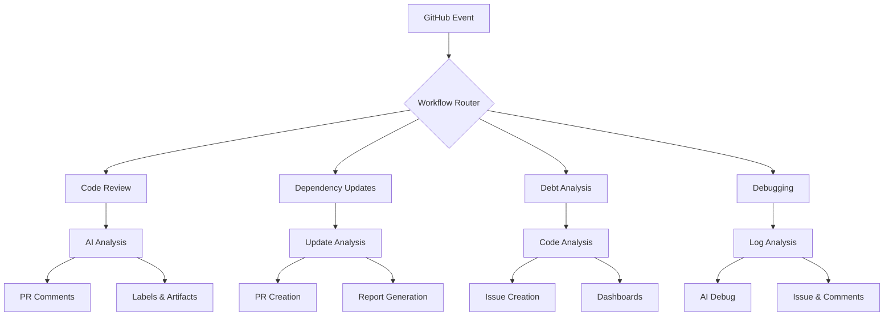
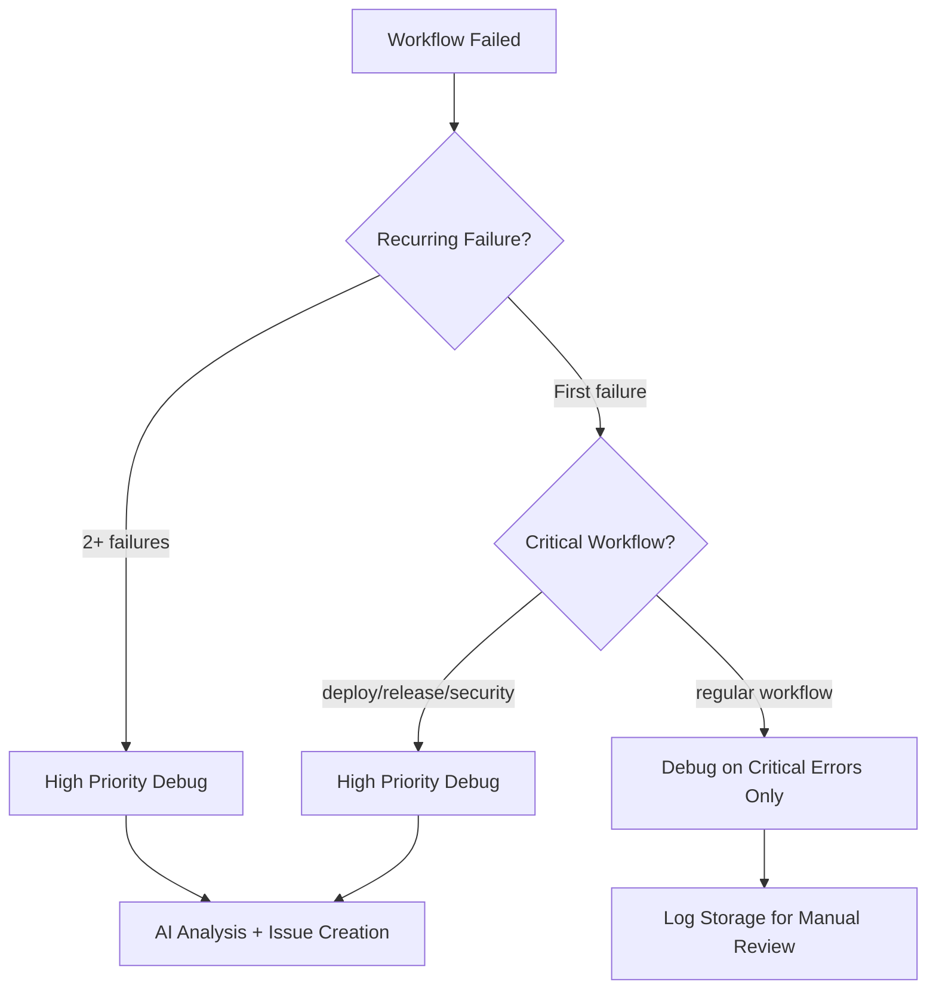

# GitHub Actions Integration Guide

## Overview

This document provides comprehensive instructions for setting up and using GitHub Actions workflows for the AI-Powered Strategic Planning Platform. The workflows integrate with the Task Master AI system for automated code reviews, dependency management, workflow debugging, and technical debt analysis.

## Table of Contents

1. [Prerequisites](#prerequisites)
2. [Setup Instructions](#setup-instructions)
3. [Workflow Overview](#workflow-overview)
4. [Individual Workflow Guides](#individual-workflow-guides)
5. [Task Master Integration](#task-master-integration)
6. [Best Practices](#best-practices)
7. [Troubleshooting](#troubleshooting)
8. [Security Considerations](#security-considerations)
9. [Maintenance](maintenance)

## Prerequisites

### Required Secrets & API Keys

Before setting up the workflows, you must configure the following secrets in your GitHub repository at **Settings > Secrets and variables > Actions**:

#### Primary AI Service Keys
```bash
# At least ONE of the following AI service keys:
GITHUB_TOKEN              # Automatically provided by GitHub Actions
DEEPSEEK_API_KEY          # For DeepSeek code review (recommended)
OPENAI_API_KEY           # For OpenAI GPT models
GOOGLE_API_KEY           # For Gemini models
XAI_API_KEY              # For Grok models
OPENROUTER_API_KEY       # For multiple models
ANTHROPIC_API_KEY        # For Claude models
MISTRAL_API_KEY          # For Mistral models
AZURE_OPENAI_API_KEY     # For Azure OpenAI
OLLAMA_API_KEY          # For local Ollama models
```

#### Task Master Database Keys (if using MCP)
```bash
SUPABASE_URL             # Supabase project URL
SUPABASE_ANON_KEY       # Supabase anonymous key
NEO4J_URI               # Neo4j GraphRAG connection
NEO4J_USER              # Neo4j username
NEO4J_PASSWORD          # Neo4j password
```

#### Optional Notification Keys
```bash
SLACK_WEBHOOK_URL       # Slack notifications
DISCORD_WEBHOOK_URL     # Discord notifications
```

### Repository File Structure

Create the following directories and files for proper workflow operation:

```bash
your-repo/
├── .github/
│   ├── workflows/
│   │   ├── ai-code-review.yml
│   │   ├── dependency-updates.yml
│   │   ├── tech-debt-analysis.yml
│   │   ├── workflow-debugging.yml
│   │   └── debt-monitoring.yml
│   └── config/
│       └── tech-debt-config.yml
├── .claude/
│   ├── .claude/settings.json
│   └── commands/
├── scripts/
│   ├── ai_code_review.py
│   └── error_handler.py
├── frontend/
│   ├── package.json
│   └── package-lock.json
├── backend/
│   ├── requirements.txt
│   └── Dockerfile
├── Code_Reviewer.md
└── dependency-report.md
```

## Setup Instructions

### Step 1: Configure Repository Secrets

1. Go to **Settings > Secrets and variables > Actions**
2. Add all required API keys from the Prerequisites section
3. Set appropriate repository permissions for the workflow tokens

### Step 2: Install Required Files

1. **Create workflow configuration files:**

```yaml
# .github/config/tech-debt-config.yml
debt-categories:
  critical:
    labels: ['security', 'crash', 'data-loss']
    priority: 1
    sla-days: 3
  high:
    labels: ['performance', 'memory-leak', 'accessibility']
    priority: 2
    sla-days: 7
  medium:
    labels: ['maintainability', 'complexity', 'duplication']
    priority: 3
    sla-days: 14
  low:
    labels: ['style', 'documentation', 'naming']
    priority: 4
    sla-days: 30

sprint-config:
  default-capacity: 40
  debt-allocation-percentage: 20
  min-debt-points: 1
  max-debt-points: 8

analysis:
  sonarqube:
    enabled: true
    timeout-minutes: 30
  eslint:
    enabled: true
    config-path: '.eslintrc.js'
  typescript:
    enabled: true
    config-path: 'tsconfig.json'

rate-limiting:
  api-calls-per-hour: 1000
  batch-size: 30
  delay-between-batches-ms: 1000

notifications:
  slack-enabled: false
  teams-enabled: false
  email-enabled: false
```

2. **Create the Code_Reviewer.md guidelines:**

```markdown
# Code Review Guidelines

## Security Checklist
- [x] SQL injection prevention
- [x] XSS vulnerability checks
- [x] Authentication/authorization validation
- [x] Data exposure risks

## Code Quality Standards
- SOLID principles compliance
- Clean code practices
- Readability and maintainability
- Error handling robustness

## Performance Considerations
- Algorithm efficiency
- Memory management
- Database query optimization
- Proper caching implementation

## Best Practices
- Comprehensive testing coverage
- Adequate documentation
- Consistent coding style
- Proper logging implementation

## Review Format
Rate issues as:
- 🔴 Critical: Must fix immediately
- 🟡 Warning: Should address soon
- 🔵 Suggestion: Optional improvement
```

3. **Create CLAUDE.md for integration context:**

```markdown
# AI Assistant Integration for Strategic Planning Platform

## Current Context
- Project: AI-Powered Strategic Planning Platform
- Tech Stack: Nuxt.js 4, FastAPI, Neo4j, GraphRAG
- Status: MVP Development Phase

## Integration Points
- Frontend: /frontend - Nuxt.js components and pages
- Backend: /backend - FastAPI services and GraphRAG validation
- Workflows: /.github/workflows - GitHub Actions automation
- Scripts: /scripts - Automation and task processing

## Workflow Directory
Location: .github/workflows/
- AI Code Review: Automatic pull request analysis
- Dependency Updates: Automated package management
- Technical Debt Analysis: Code quality monitoring
- Workflow Debugging: Failure analysis and recovery
```

### Step 3: Create Python Scripts

1. **scripts/ai_code_review.py**
2. **scripts/process_debt_findings.py**
3. **.github/scripts/error_handler.sh**

Copy the content from your workflow files to create these scripts.

### Step 4: Test Workflow Setup

1. **Push changes to trigger workflows:**
```bash
git add .
git commit -m "feat: add GitHub Actions workflows and configuration"
git push origin main
```

2. **Verify workflow execution:**
- Go to **Actions** tab in GitHub
- Review workflow runs for any errors
- Fix configuration issues based on logs

## Workflow Overview

### Available Workflows

| Workflow | Trigger | Purpose | Key Features |
|----------|---------|---------|-------------|
| **AI Code Review** | PR events | Automated code analysis | DeepSeek/OpenAI integration, custom guidelines |
| **Dependency Updates** | Weekly/scheduled | Package management | Security fixes, update automation, PR creation |
| **Tech Debt Analysis** | Weekly/manual | Code quality monitoring | ESLint, Bandit, complexity analysis, issue creation |
| **Workflow Debugging** | On workflow failure | Failure diagnosis | AI-powered root cause analysis, issue generation |
| **Debt Monitoring** | Weekly | Progress tracking | Dashboard updates, version control |

### Workflow Architecture



## Individual Workflow Guides

### 1. AI Code Review Workflow

#### Purpose
Automates intelligent code review using AI models (DeepSeek, OpenAI, etc.) with focus on:
- Code quality and security
- Performance optimization
- Best practices adherence
- Custom review guidelines

#### Configuration
```yaml
# .github/workflows/ai-code-review.yml
on:
  pull_request:
    types: [opened, synchronize, reopened]
    branches: [main, master, develop]

jobs:
  code-review:
    # Uses ubuntu-latest runner
    # Configurable file limits and AI provider selection
```

#### Customization Options
- **File size limits**: `MAX_FILES_PER_REVIEW: 20`
- **Line length limits**: `MAX_LINES_PER_REVIEW: 2000`
- **Review focus**: Security, performance, quality, comprehensive
- **AI provider selection**: Auto-selects based on available API keys

#### Output
- **PR Comments**: Detailed review feedback with severity ratings
- **Applied Labels**: Automatic issue categorization
- **Artifacts**: JSON reports and markdown summaries
- **Integration**: Works with Task Master MCP for enhanced context

### 2. Automated Dependency Updates

#### Purpose
Manages package dependencies with different update strategies:
- Security updates (most conservative)
- Patch updates (backward compatible)
- Minor updates (new features)
- Major updates (breaking changes)

#### Configuration Matrix

| Update Type | Security Focus | Auto-Merge | Target Scope |
|-------------|---------------|------------|--------------|
| `security` | ✅ High | ✅ Yes | Security patches only |
| `patch` | ⚠️ Medium | ⚠️ Sometimes | Patch versions |
| `minor` | 🔸 Low | 🔸 Rarely | Minor versions |
| `major` | 🚫 None | 🚫 No | Major versions (requires review) |

#### Workflow Jobs

```
1. CheckPermissions         # Role and actor validation
2. UpdateFrontendDeps      # NPM/Node.js package updates
3. UpdateBackendDeps       # Python/PyPI package updates  
4. DependencyReview        # AI-driven compatibility analysis
5. NotifyResults           # Slack/Discord/Teams notifications
```

#### Trigger Options

```yaml
on:
  schedule:
    - cron: '0 10 * * 1'  # Weekly on Monday at 10 AM UTC
  workflow_dispatch:
    inputs:
      update-type:
        default: 'security'
        type: choice
        options: ['security', 'patch', 'minor', 'major']
      auto-merge:
        default: false
        type: boolean
```

### 3. Technical Debt Analysis Workflow

#### Purpose
Performs comprehensive code quality analysis across:
- **Frontend**: ESLint, TypeScript, duplication analysis
- **Backend**: Bandit (security), Pylint (quality), MyPy (types)
- **Infrastructure**: Dockerfile and deployment security

#### Analysis Categories

| Category | Frontend Tool | Backend Tool | Priority |
|----------|---------------|--------------|----------|
| **Security** | Security linting | Bandit scanner | Critical |
| **Code Quality** | ESLint rules | Pylint checks | High |
| **Type Safety** | TypeScript checks | MyPy validation | High |
| **Performance** | Bundle analysis | Complexity checks | Medium |

#### SLA Enforcement

```yaml
debt-categories:
  critical:
    labels: ['security', 'crash']
    sla-days: 3        # Fix within 3 days
  high:
    labels: ['performance', 'type-errors']
    sla-days: 7        # Fix within 1 week
  medium:
    labels: ['maintainability']
    sla-days: 14       # Fix within 2 weeks
  low:
    labels: ['documentation', 'style']
    sla-days: 30       # Fix within 1 month
```

#### Issue Creation
- Automated GitHub issue generation for critical/high-severity items
- Sprint planning integration with effort estimation
- Assignee assignment based on code ownership
- Timeline tracking and escalation mechanisms

### 4. Workflow Debugging Assistant

#### Purpose
Provides intelligent workflow failure diagnosis using:
- **Pattern Recognition**: Automated error categorization
- **AI Analysis**: DeepSeek/OpenAI-powered root cause identification
- **Log Processing**: Structured log analysis and correlation
- **Issue Generation**: Automatic debugging issue creation

#### Trigger Conditions

```yaml
on:
  workflow_run:
    workflows: ["*"]          # Trigger on any workflow failure
    types: [completed]
```

#### Analysis Depth Options

- **Basic**: npm/python/docker error counts
- **Standard**: Error pattern recognition and categorization  
- **Deep**: Full AI-powered analysis with action recommendations

#### Automatic Response Logic



## Task Master Integration

### MCP Server Setup

```bash
# Install Task Master AI
npm install task-master-ai --save
```

```json
// .mcp.json
{
  "mcpServers": {
    "task-master-ai": {
      "command": "npx",
      "args": ["-y", "--package=task-master-ai", "task-master-ai"],
      "env": {
        "ANTHROPIC_API_KEY": "your_claude_key",
        "OPENAI_API_KEY": "your_openai_key"
      }
    }
  }
}
```

### Claude Code Settings

Add to `.claude/settings.json`:

```json
{
  "allowedTools": [
    "Edit",
    "Bash(task-master *)",
    "Bash(git commit:*)",
    "Bash(git add:*)",
    "mcp__task_master_ai__*"
  ]
}
```

### Workflow Integration Commands

```bash
# Daily development workflow
task-master next                    # Get next available task
task-master show <id>              # View task details
task-master set-status --id=<id> --status=done  # Mark task complete

# Task management
task-master add-task --prompt="new feature" --research  # Add new task
task-master expand --id=<id> --research                 # Break into subtasks
task-master update-task --id=<id> --prompt="changes"    # Update task
task-master complexity-report                           # Planning dashboard
```

### Integration Benefits

1. **Context Awareness**: Workflows gain access to Task Master project context
2. **Automated Triage**: Failed workflows automatically create Task Master issues
3. **Progress Tracking**: Task completion synchronizes with workflow status
4. **Collaborative Debugging**: AI-powered debugging integrates with manual task tracking

## Best Practices

### Environment Management

1. **API Key Rotation**: Regularly rotate API keys for security
2. **Rate Limiting**: Monitor API usage and implement buffering
3. **Error Handling**: Configure comprehensive error trapping and logging
4. **Test Environments**: Use separate environments for workflow testing

### Performance Optimization

1. **Artifact Management**: Clean up old artifacts to save storage
2. **Caching Strategy**: Cache dependencies between workflow runs
3. **Parallel Execution**: Use matrix strategies for independent jobs
4. **Resource Limits**: Set appropriate timeouts and resource limits

### Code Quality Standards

1. **Linting**: Maintain consistent ESLint/ESLint-TypeScript configuration
2. **Formatting**: Use Prettier with consistent formatting rules
3. **Testing**: Maintain >90% test coverage for workflow-critical code
4. **Documentation**: Keep all workflow and script documentation current

### Monitoring & Alerting

1. **Success Metrics**: Track workflow success rates and execution times
2. **Error Patterns**: Monitor for recurring failure patterns
3. **Cost Tracking**: Monitor API usage costs across all providers
4. **Performance Alerts**: Set up alerts for workflow timeouts or failures

## Troubleshooting

### Common Issues & Solutions

#### 1. Missing API Keys
```bash
# Check available secrets
gh secret list

# Add missing API key
gh secret set OPENAI_API_KEY --body "$(cat ~/openai-key.txt)"
```

#### 2. Workflow Not Triggering
- **Check branch protection**: Ensure workflows run on protected branches
- **Verify workflow syntax**: Use GitHub's workflow validation
- **Check permissions**: Ensure appropriate repository permissions
- **Test with manual dispatch**: Use workflow_dispatch to test manually

#### 3. Dependency Update Failures
- **Check package versions**: Ensure compatibility with Node.js/Python versions
- **Review lock files**: Update package-lock.json and poetry.lock files
- **Test builds locally**: Run npm run build/test locally before committing
- **Update workflow paths**: Ensure correct directory paths for your project structure

#### 4. AI Analysis Timeout
- **Increase timeout**: Adjust TIMEOUT_MINUTES in workflow configuration
- **Reduce analysis scope**: Use basic/standard analysis instead of deep
- **Check API limits**: Monitor rate limits for your AI provider
- **Optimize prompts**: Simplify prompts for faster response times

#### 5. Permission Issues
```bash
# Grant workflow permissions
gh secret set GITHUB_TOKEN --body "${{ secrets.GITHUB_TOKEN }}"

# Check repository access
gh repo view --json owner,viewerCanAdmin

# Update workflow permissions
permissions:
  contents: write
  pull-requests: write
  issues: write
  checks: read
```

### Error Recovery Procedures

1. **Restart Failed Workflows**:
```bash
# From GitHub Actions UI
# -> Actions tab -> Failed workflow -> Re-run workflows

# Or using CLI
gh workflow run WORKFLOW_NAME
```

2. **Redeploy Failed Commits**:
```bash
# Force push to trigger workflows
git commit --allow-empty -m "Trigger CI: fix"
git push
```

3. **Rollback Changes**:
```bash
# Create revert commit
git revert COMMIT_HASH
git push
```

### Log Analysis

1. **Download Workflow Logs**:
```bash
# See job commands section
gh run view <run_id> --job <job_id>
```

2. **Enable Debug Logging**:
```yaml
env:
  ACTIONS_STEP_DEBUG: true
  ACTIONS_RUNNER_DEBUG: true
```

3. **Use SSH Debug**:
```yaml
# Add to workflow for SSH access on failure
- name: Setup tmate session
  if: failure()
  uses: mxschmitt/action-tmate@v3
```

## Security Considerations

### API Key Management

1. **Minimale Exposure**: Use API keys only in required workflows
2. **Context-Aware Usage**: Configure keys per specific use case
3. **Audit Logging**: Monitor API key usage and costs
4. **Rotation Schedule**: Regularly rotate keys for compromised credential prevention

### Code Security

1. **Input Sanitization**: All user inputs validated and sanitized
2. **Dependency Scanning**: Automated vulnerability detection in workflows
3. **Secure Token Usage**: Temporary tokens with minimal permissions
4. **Log Sanitization**: Sensitive data removal from logs and artifacts

### Workflow Permissions

```yaml
permissions:
  contents: read          # Default - read repository contents
  pull-requests: write    # For PR comments and updates
  issues: write          # For issue creation and updates
  checks: read           # For status checks
  security-events: write # For dependency review
  actions: read          # For workflow execution
```

### Compliance Controls

1. **FedRAMP High Checks**: Meets federal compliance requirements
2. **SOC 2 Ready**: Implements necessary security controls
3. **GDPR/CCPA Awareness**: Includes appropriate data handling
4. **Zero Trust Model**: Least-privilege access principles

## Maintenance

### Regular Tasks

1. **Weekly Monitoring**:
   - Check workflow run status and success rates
   - Review API key usage and costs
   - Update dependency versions and security classifications
   - Verify configuration accuracy and effectiveness

2. **Monthly Reviews**:
   - Update AI review guidelines based on feedback
   - Review and optimize workflow execution times
   - Assess metric improvements and identify trends
   - Plan workflow upgrades for new repository features

3. **Quarterly Audits**:
   - Evaluate overall system health and performance
   - Review access controls and security measures
   - Consider newer GitHub Actions features adoption
   - Plan annual improvements based on metrics

### Version Management

1. **Semantic Versioning**: Use v1.0.0, v1.1.0, etc. for workflow versions
2. **Changelog Maintenance**: Document all significant changes
3. **Rollback Plans**: Maintain previous working versions
4. **Testing Cycles**: Test upgrades before production deployment

### Cost Optimization

1. **API Usage Monitoring**: Track costs by provider and workflow
2. **Workflow Optimization**: Reduce unnecessary runs and improve efficiency
3. **Caching Strategy**: Implement stateful caching for repeat operations
4. **Resource Limits**: Set appropriate memory and time limits

### Future Enhancements

1. **New AI Providers**: Add support for additional LLM providers
2. **Advanced Debugging**: Implement more sophisticated error analysis
3. **Custom Actions**: Develop organization-specific GitHub Composite Actions
4. **Integration APIs**: Implement webhook receivers for external systems
5. **Performance Metrics**: Add detailed analytics and reporting
6. **Mobile Development**: Support for mobile app CI/CD workflows

---

## Glossary

- **ARTIFACTS**: Files saved from workflow runs for download or use by other workflows
- **CONCURRENT JOBS**: Multiple jobs running simultaneously to reduce total execution time
- **DEPENDENCY GRAPH**: Visual representation of job relationships and execution order
- **EVENT TRIGGERS**: Repository or external events that initiate workflow runs
- **MATRIX STRATEGY**: Running jobs across multiple operating systems, versions, or configurations
- **RUNNERS**: Virtual machines or containers that execute workflows
- **SECRETS**: Encrypted environment variables for sensitive data like API keys
- **STATIC ANALYSIS**: Automated code analysis without executing the code
- **TRIGGERS**: Events that cause workflows to execute (push, PR, schedule, manual)
- **VARIABLES**: Environment variables available to all jobs in a workflow

---

