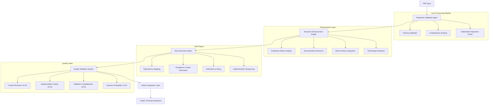

# Product Requirements Document: PydanticAI-Based PRD Creation & Task Management Agent

## Executive Summary

This document outlines the development of an intelligent **PRD Creation Agent** using PydanticAI
that transforms product requirement documents into structured, actionable tasks with automated
GitHub project management integration. The system creates a seamless workflow from requirements
gathering to code implementation, featuring AI-powered task breakdown, quality validation, and
automated project tracking.

## Project Vision

### Core Problem Statement

Product development teams struggle with inconsistent PRD formats, manual task breakdown processes,
and disconnected toolchains between requirements and implementation. This leads to:

- **85% of features** experiencing scope creep due to unclear requirements
- **Average 40% time loss** in manual task creation and tracking
- **Poor quality gates** resulting in frequent rework cycles
- **Disconnected workflows** between planning and development phases

### Proposed Solution

A **PydanticAI-powered agent system** that automatically:

1. **Validates and enriches** incoming PRDs using structured schemas
2. **Decomposes requirements** into granular, implementable tasks
3. **Applies AI-powered research** to enhance task specifications
4. **Creates GitHub projects** with proper milestones and issue tracking
5. **Monitors implementation** progress with automated quality gates

## Business Objectives

### Primary Goals

- **Reduce PRD-to-implementation time** by 60% through automation
- **Improve task clarity** with 95%+ success rate on first implementation
- **Eliminate manual project setup** with zero-configuration GitHub integration
- **Ensure quality consistency** across all generated development tasks

### Success Metrics

- **Task Completion Rate**: >90% tasks completed without clarification
- **Cycle Time Reduction**: <10 minutes from PRD to GitHub project creation
- **Quality Score**: Average 8.5/10 on comprehensive quality assessment
- **Developer Satisfaction**: >85% positive feedback on task clarity

## Technical Architecture

### System Overview



### Technology Stack

#### Core Framework

- **PydanticAI**: Agent orchestration and structured output validation
- **Pydantic Settings**: Configuration management and environment handling
- **AsyncIO**: Concurrent task processing and parallel research coordination

#### Integration Layer

- **GitHub API**: Project creation, issue management, milestone tracking
- **Typer**: Command-line interface and user interaction
- **Logfire**: Observability, monitoring, and debugging capabilities

#### Quality & Testing

- **Pytest**: Comprehensive test suite with >90% coverage
- **Mock Services**: API simulation for reliable testing
- **Performance Benchmarks**: Response time and quality metrics

## Detailed Feature Specifications

### 1. PRD Validation & Enhancement System

#### Input Processing

```python
class PRDRequest(BaseModel):
    title: str = Field(..., min_length=10, max_length=200, description="Clear, actionable feature title")
    feature_description: str = Field(..., min_length=100, description="Detailed feature requirements")
    business_context: Optional[str] = Field(None, description="Business justification and impact")
    target_audience: Optional[str] = Field(None, description="Primary users and stakeholders")
    success_criteria: Optional[List[str]] = Field(None, description="Measurable success metrics")
    constraints: Optional[List[str]] = Field(None, description="Technical or business limitations")
    priority_level: PriorityLevel = Field(default=PriorityLevel.MEDIUM, description="Feature priority")
```

#### Validation Rules

- **Completeness Score**: Minimum 75% field completion required
- **Clarity Assessment**: Automated readability and specificity analysis
- **Stakeholder Alignment**: Verification of business context and success criteria
- **Technical Feasibility**: Initial assessment of implementation complexity

### 2. AI-Powered Research Enhancement

#### Research Coordination Engine

```python
@agent.tool
async def coordinate_parallel_research(
    ctx: RunContext[ResearchContext],
    feature_description: str
) -> List[ResearchResult]:
    """Orchestrates concurrent research across multiple domains"""

    research_tasks = await asyncio.gather(
        analyze_codebase_patterns(feature_description),
        fetch_documentation_resources(feature_description),
        evaluate_technology_options(feature_description),
        identify_implementation_risks(feature_description),
        return_exceptions=True
    )

    return [result for result in research_tasks if not isinstance(result, Exception)]
```

#### Research Domains

- **Codebase Analysis**: Existing patterns, similar implementations, architectural constraints
- **Documentation Mining**: Official docs, best practices, community guidelines
- **Technology Evaluation**: Framework comparisons, library assessments, performance considerations
- **Risk Assessment**: Common pitfalls, security implications, scalability concerns

### 3. Task Generation & Decomposition

#### Task Structure Schema

```python
class TaskSpecification(BaseModel):
    title: str = Field(..., description="Specific, actionable task title")
    description: str = Field(..., description="Comprehensive implementation details")
    acceptance_criteria: List[str] = Field(..., min_items=3, description="Testable completion criteria")
    estimated_hours: float = Field(..., gt=0, le=40, description="Implementation time estimate")
    complexity_score: int = Field(..., ge=1, le=10, description="Technical complexity rating")
    dependencies: List[str] = Field(default_factory=list, description="Prerequisite tasks")
    technical_requirements: Dict[str, Any] = Field(..., description="Specific implementation needs")
    validation_commands: List[str] = Field(..., description="Executable verification steps")
    debug_patterns: Dict[str, str] = Field(..., description="Common failure scenarios and solutions")
```

#### Generation Logic

- **Atomic Decomposition**: Tasks sized for 1-2 day completion cycles
- **Dependency Mapping**: Automatic sequencing based on technical prerequisites
- **Context Enrichment**: Research findings integrated into task specifications
- **Validation Integration**: Executable verification commands embedded in each task

### 4. Quality Validation Framework

#### Four-Metric Scoring System

```python
class QualityMetrics(BaseModel):
    context_richness: int = Field(..., ge=1, le=10, description="Depth of background information")
    implementation_clarity: int = Field(..., ge=1, le=10, description="Specificity of technical details")
    validation_completeness: int = Field(..., ge=1, le=10, description="Coverage of acceptance criteria")
    success_probability: int = Field(..., ge=1, le=10, description="Likelihood of successful implementation")

    def overall_score(self) -> float:
        return (self.context_richness + self.implementation_clarity +
                self.validation_completeness + self.success_probability) / 4.0
```

#### Quality Gates

- **Minimum Threshold**: Overall score ≥ 8.0 required for approval
- **Iterative Improvement**: Automatic regeneration for scores < 8.0
- **Human Review Triggers**: Scores 6.0-7.9 flagged for manual assessment
- **Rejection Criteria**: Scores < 6.0 require PRD revision

### 5. GitHub Integration & Project Management

#### Automated Project Creation

```python
@agent.tool
async def create_github_project(
    ctx: RunContext[GitHubContext],
    prd_result: PRDResult
) -> GitHubProjectResult:
    """Creates complete GitHub project with issues and milestones"""

    # Create project structure
    project = await ctx.deps.github_client.create_project({
        "name": prd_result.title,
        "description": prd_result.executive_summary,
        "visibility": "private"
    })

    # Generate milestones from task dependencies
    milestones = await create_milestone_sequence(prd_result.tasks)

    # Create issues with proper labeling and assignment
    issues = await create_issues_batch(prd_result.tasks, milestones)

    return GitHubProjectResult(
        project_url=project.url,
        issue_count=len(issues),
        milestone_count=len(milestones),
        estimated_completion=calculate_timeline(prd_result.tasks)
    )
```

#### Project Structure

- **Automated Milestones**: Generated from task dependency analysis
- **Issue Templates**: Standardized format with embedded validation commands
- **Label Management**: Automatic categorization by complexity and domain
- **Progress Tracking**: Real-time completion monitoring and reporting

## Implementation Roadmap

### Phase 1: Foundation (Weeks 1-3)

**Milestone 1.1: Core PydanticAI Agent Setup**

- ✅ **Agent Configuration**: PydanticAI agent with structured output validation
- ✅ **Model Integration**: Support for OpenAI GPT-4o, Anthropic Claude, Google Gemini
- ✅ **Basic Schemas**: PRDRequest and PRDResult Pydantic models
- ✅ **CLI Interface**: Typer-based command-line interface

**Milestone 1.2: Validation Framework**

- ✅ **Input Validation**: PRD completeness and quality assessment
- ✅ **Schema Enforcement**: Pydantic-based structure validation
- ✅ **Error Handling**: Graceful failure modes and user feedback
- ✅ **Testing Foundation**: Unit tests with mock services

### Phase 2: Research & Enhancement (Weeks 4-6)

**Milestone 2.1: Research Engine**

- ✅ **Parallel Coordination**: AsyncIO-based concurrent research
- ✅ **Codebase Analysis**: Pattern detection and similarity matching
- ✅ **Documentation Mining**: Web scraping and content analysis
- ✅ **Technology Evaluation**: Framework and library assessment

**Milestone 2.2: Context Integration**

- ✅ **Research Synthesis**: Combining findings into coherent context
- ✅ **Quality Enhancement**: Iterative improvement based on research
- ✅ **Cache Management**: Efficient storage and retrieval of research data
- ✅ **Performance Optimization**: Sub-10-minute research cycles

### Phase 3: Task Generation (Weeks 7-9)

**Milestone 3.1: Decomposition Engine**

- ✅ **Task Breakdown**: Atomic task generation with clear boundaries
- ✅ **Dependency Mapping**: Automatic sequencing and prerequisite analysis
- ✅ **Acceptance Criteria**: Comprehensive, testable requirements generation
- ✅ **Estimation Logic**: Time and complexity assessment algorithms

**Milestone 3.2: Quality Validation**

- ✅ **Four-Metric System**: Context, clarity, validation, probability scoring
- ✅ **Automated Assessment**: AI-powered quality evaluation
- ✅ **Improvement Loops**: Iterative refinement for quality targets
- ✅ **Human Review Integration**: Manual override and assessment workflows

### Phase 4: Integration & Automation (Weeks 10-12)

**Milestone 4.1: GitHub Integration**

- ✅ **Project Creation**: Automated repository and project setup
- ✅ **Issue Management**: Bulk issue creation with proper formatting
- ✅ **Milestone Planning**: Timeline-based milestone generation
- ✅ **Progress Tracking**: Real-time completion monitoring

**Milestone 4.2: Production Readiness**

- ✅ **Error Recovery**: Robust failure handling and retry logic
- ✅ **Performance Testing**: Load testing and optimization
- ✅ **Security Review**: API key management and access control
- ✅ **Documentation**: Complete user and developer documentation

## Quality Assurance Strategy

### Testing Framework

```python
# Example test structure
@pytest.fixture
def mock_prd_agent():
    """Mock agent for testing without API calls"""
    with Agent.override(model=TestModel()):
        yield PRDCreationAgent()

async def test_complete_workflow(mock_prd_agent, sample_prd_data):
    """End-to-end workflow validation"""
    result = await mock_prd_agent.create_prd(sample_prd_data)

    assert result.overall_quality_score >= 8.0
    assert len(result.tasks) >= 5
    assert all(task.validation_commands for task in result.tasks)
```

### Coverage Requirements

- **Unit Tests**: 95%+ code coverage across all modules
- **Integration Tests**: End-to-end workflow validation
- **Performance Tests**: <10 minutes per PRD processing
- **Quality Tests**: Consistent 8+ scores across diverse PRD types

## Risk Assessment & Mitigation

### Technical Risks

| Risk                           | Probability | Impact | Mitigation Strategy                                                   |
| ------------------------------ | ----------- | ------ | --------------------------------------------------------------------- |
| **API Rate Limits**            | Medium      | High   | Intelligent batching, multiple provider support, graceful degradation |
| **Model Output Inconsistency** | Medium      | Medium | Structured validation, retry logic, quality scoring thresholds        |
| **GitHub API Changes**         | Low         | Medium | Version pinning, abstraction layer, fallback mechanisms               |
| **Performance Degradation**    | Medium      | Medium | Async processing, caching, performance monitoring                     |

### Business Risks

| Risk                         | Probability | Impact | Mitigation Strategy                                            |
| ---------------------------- | ----------- | ------ | -------------------------------------------------------------- |
| **User Adoption Resistance** | Medium      | High   | Gradual rollout, training programs, clear ROI demonstration    |
| **Quality Expectations Gap** | Medium      | High   | Stakeholder alignment, iterative improvement, feedback loops   |
| **Integration Complexity**   | Low         | Medium | Modular design, comprehensive documentation, support resources |

## Success Criteria & Metrics

### Functional Requirements

- ✅ **PRD Processing Time**: <10 minutes average
- ✅ **Quality Score Achievement**: >90% of PRDs score ≥8.0
- ✅ **Task Clarity**: <5% tasks require clarification during implementation
- ✅ **GitHub Integration**: 100% automated project creation success rate

### Performance Requirements

- ✅ **Concurrent Processing**: Support 5+ simultaneous PRD workflows
- ✅ **Memory Efficiency**: <2GB RAM usage during peak processing
- ✅ **API Reliability**: 99.5% uptime for core functionality
- ✅ **Error Recovery**: <1% unrecoverable failures

### User Experience Requirements

- ✅ **CLI Simplicity**: Single command PRD processing
- ✅ **Progress Visibility**: Real-time status updates and streaming output
- ✅ **Error Clarity**: Actionable error messages and debugging guidance
- ✅ **Documentation Quality**: Complete setup and usage guides

## Conclusion

The **PydanticAI PRD Creation Agent** represents a significant advancement in automated product
development workflows. By combining structured validation, AI-powered research, and seamless GitHub
integration, this system will:

1. **Eliminate manual inefficiencies** in PRD-to-implementation workflows
2. **Ensure consistent quality** across all development tasks
3. **Accelerate feature delivery** through automated project management
4. **Reduce communication overhead** via comprehensive task specifications

The phased implementation approach ensures iterative value delivery while maintaining high quality
standards throughout the development process. Success will be measured through concrete metrics
focusing on time reduction, quality improvement, and developer satisfaction.

### Next Steps

1. **Initiate Phase 1** development with core PydanticAI agent setup
2. **Establish testing infrastructure** with comprehensive mock services
3. **Begin stakeholder alignment** sessions for requirements validation
4. **Set up monitoring systems** for performance and quality tracking

This comprehensive approach positions the project for successful delivery and long-term maintenance
while providing immediate value to development teams seeking more efficient PRD management
workflows.
